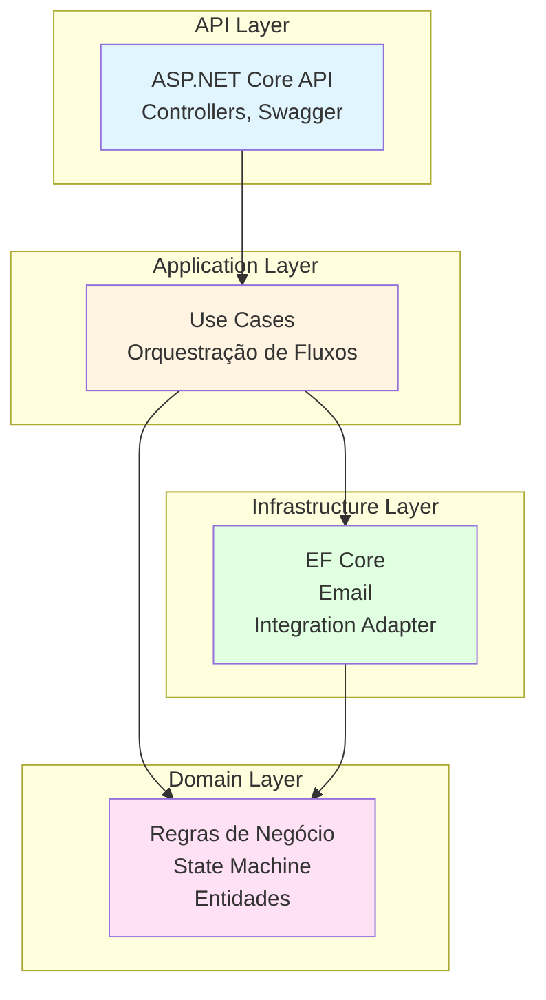

# Arquitetura — Transferência de Materiais Entre Filiais

> **Arquitetura e Design Técnico** — Componentes, boundaries, integrações e modelos de dados.
> Desenvolvido por **ness.**
> **Repositório:** [https://github.com/resper1965/nTransfer](https://github.com/resper1965/nTransfer)
> Referências: [SPEC.md](./specs/transferencia-materiais/SPEC.md), [DEVELOPMENT_GUIDE.md](./DEVELOPMENT_GUIDE.md), [data-model.md](./data-models/data-model.md)

## 1. Visão Geral da Arquitetura

A aplicação segue **Clean Architecture** com separação clara de responsabilidades:



**Princípio fundamental:** Domain não depende de camadas externas. Regras de negócio (RB-01..RB-10) ficam isoladas em `Domain`.

Ver também: [Diagrama de Arquitetura em diagrams.md](./specs/transferencia-materiais/diagrams.md#arquitetura-de-camadas-clean-architecture)

## 2. Camadas e Responsabilidades

### 2.1 Domain (`src/TransferenciaMateriais.Domain/`)

**Responsabilidades:**
- Regras de negócio (RB-01..RB-10) — ver [SPEC.md](./specs/transferencia-materiais/SPEC.md#regras-de-negócio-rb)
- State Machine do workflow (F1/F2/F3) — ver [diagrams.md](./specs/transferencia-materiais/diagrams.md)
- Entidades do domínio (OS, OC, NFe, Vínculo, Aprovação, Anexo)
- Interfaces de serviços externos (`IIntegrationAdapter`, `IEmailSender`)

**Arquivos existentes:**
- `IntegrationAdapter.cs` — Interface para integração Qive↔RM ([TBD-01](./specs/transferencia-materiais/TBD.md#tbd-01--mecanismo-de-integração-qive--rm))
- `EmailSender.cs` — Interface para envio de e-mail ([DEC-02](./specs/transferencia-materiais/TBD.md#decisões-fechadas))

**Regras implementadas:**
- RB-01: Cada OS vincula uma ou mais NFe
- RB-02: OS contém filial destino 1:1 e quantidade
- RB-03: Não travar por divergência de quantidade
- RB-04: Anexo obrigatório na entrada destino
- RB-05: Cancelar etapas anteriores quando NFe incorreta
- RB-06: Reprovar para orientar nova NFe
- RB-07: Atualizar estoque não contábil conforme fluxo
- RB-08: Entrega futura mãe sem atualizar estoque
- RB-09: Aviso 30 dias (filial destino)
- RB-10: Aviso 7 dias (entrega estimada)

### 2.2 Application (`src/TransferenciaMateriais.Application/`)

**Responsabilidades:**
- Use-cases (orquestração de fluxos F1/F2/F3)
- Validações de entrada
- Coordenação entre Domain e Infrastructure

**A implementar:**
- Use-cases para cada RF (RF-01..RF-11)
- Validações de regras de negócio antes de persistir

### 2.3 Infrastructure (`src/TransferenciaMateriais.Infrastructure/`)

**Responsabilidades:**
- Persistência (EF Core + PostgreSQL)
- Implementação de `IIntegrationAdapter` (stub até [TBD-01](./specs/transferencia-materiais/TBD.md#tbd-01--mecanismo-de-integração-qive--rm))
- Implementação de `IEmailSender` (stub/Mailpit)
- Migrations do banco de dados

**Arquivos existentes:**
- `Integration/StubIntegrationAdapter.cs` — Stub da integração Qive↔RM
- `Email/StubEmailSender.cs` — Stub do serviço de e-mail

**Dependências:**
- EF Core 8.0
- Npgsql (PostgreSQL)
- Microsoft.Extensions.Configuration

### 2.4 API (`src/TransferenciaMateriais.Api/`)

**Responsabilidades:**
- Controllers REST (conforme [openapi.yaml](./contracts/openapi.yaml))
- Swagger/OpenAPI
- Autenticação/autorização (Bearer JWT — ver [openapi.yaml](./contracts/openapi.yaml#L17))
- Middleware de auditoria

**Nota:** Para princípios e padrões de UX/UI, ver [DESIGN_GUIDE.md](./DESIGN_GUIDE.md).

**Arquivos existentes:**
- `Program.cs` — Startup com Swagger configurado
- `Controllers/HealthController.cs` — Health check

**Endpoints a implementar** (conforme [openapi.yaml](./contracts/openapi.yaml)):
- `POST /os` — Criar OS ([RF-01](./specs/transferencia-materiais/SPEC.md#requisitos-funcionais-rf))
- `PATCH /os/{osId}` — Atualizar OS
- `POST /vinculos` — Criar vínculo ([RF-02](./specs/transferencia-materiais/SPEC.md#requisitos-funcionais-rf))
- `POST /fiscal/nfe/{chaveAcesso}/validacao` — Validar NFe ([RF-03](./specs/transferencia-materiais/SPEC.md#requisitos-funcionais-rf))
- `POST /aprovacoes/{aprovacaoId}/decisao` — Aprovar/Reprovar
- `POST /anexos` — Registrar anexo ([RF-04](./specs/transferencia-materiais/SPEC.md#requisitos-funcionais-rf))
- `GET /paineis/oc-pendente-entrega-futura` — Painel OC pendente ([RF-07](./specs/transferencia-materiais/SPEC.md#requisitos-funcionais-rf))
- `POST /integrations/qive/nfe-recebida` — Webhook integração ([TBD-01](./specs/transferencia-materiais/TBD.md#tbd-01--mecanismo-de-integração-qive--rm))
- `GET /auditoria` — Consultar eventos ([RF-08](./specs/transferencia-materiais/SPEC.md#requisitos-funcionais-rf))

## 3. State Machine (Workflow)

### Objetivo

Padronizar estados e transições do processo para suportar:
- consistência entre painéis e API
- rastreabilidade (auditoria)
- comportamento previsível em exceções (NFe incorreta, erro de vínculo, falta de anexo)

### Fonte Única

- [`docs/specs/transferencia-materiais/workflow-states.md`](./specs/transferencia-materiais/workflow-states.md) — Mapeamento por fluxo e regra de consistência
- [`docs/data-models/data-model.md`](./data-models/data-model.md) — `WorkflowStatus` canônico (Seção 2.2)
- [`docs/contracts/openapi.yaml`](./contracts/openapi.yaml) — `components/schemas/WorkflowStatus` deve ser idêntico

### Implementação (Diretriz)

A máquina de estados é explícita (tabela de estados/transições) para facilitar auditoria e manutenção ([CONSTITUTION.md](./specs/transferencia-materiais/CONSTITUTION.md#d01--state-machine-explícita)).

O workflow deve ser implementado como **máquina de estados** com:
- estado atual (`os.statusWorkflow` ou equivalente por correlação)
- transições autorizadas (por fluxo e papel)
- validações pré-transição (ex.: anexo obrigatório antes de concluir entrada no destino)

**Exceções devem resultar em:**
- transição para estado de correção quando aplicável (ex.: `CORRECAO_EMISSAO_OU_VINCULO`)
- e/ou criação de `Pendencia` com `ownerRole` definido

**Fluxos suportados:**
- **F1: Compra Direta** — Ver [diagrams.md](./specs/transferencia-materiais/diagrams.md#f1--compra-direta-estados)
- **F2: Entrega Futura (mãe)** — Ver [diagrams.md](./specs/transferencia-materiais/diagrams.md#f2--entrega-futura-mãe--estados)
- **F3: Entrega Futura (filha)** — Ver [diagrams.md](./specs/transferencia-materiais/diagrams.md#f3--entrega-futura-filha--estados)

**Transições:**
- Cada transição gera evento de auditoria `WORKFLOW_TRANSICAO` ([RNF-01](./specs/transferencia-materiais/SPEC.md#requisitos-não-funcionais-rnf))
- Validações RB aplicadas antes de permitir transição

### Consistência (Obrigatória)

Qualquer novo estado exige atualização coordenada de:
- [`workflow-states.md`](./specs/transferencia-materiais/workflow-states.md)
- [`data-model.md`](./data-models/data-model.md)
- [`openapi.yaml`](./contracts/openapi.yaml)

e registro em [`TBD.md`](./specs/transferencia-materiais/TBD.md) se depender de decisão.

## 4. Modelo de Dados

Ver [data-model.md](./data-models/data-model.md) para estrutura completa.

**Entidades principais:**
- **OS** — Ordem de Serviço ([RB-02](./specs/transferencia-materiais/SPEC.md#regras-de-negócio-rb))
- **OC** — Ordem de Compra
- **NFe** — Nota Fiscal Eletrônica
- **Vínculo** — Relacionamento OS↔OC↔NFe ([RB-01](./specs/transferencia-materiais/SPEC.md#regras-de-negócio-rb))
- **Aprovação** — Aprovações/reprovações (entrega, medição, vínculo)
- **Anexo** — Evidências obrigatórias ([RB-04](./specs/transferencia-materiais/SPEC.md#regras-de-negócio-rb))
- **AuditoriaEvento** — Trilha imutável ([RNF-01](./specs/transferencia-materiais/SPEC.md#requisitos-não-funcionais-rnf))

**Relacionamentos:**
- OS 1..N Vínculos ([RB-01](./specs/transferencia-materiais/SPEC.md#regras-de-negócio-rb))
- Vínculo referencia NFe (e OC no fluxo filha)
- Cada entidade gera eventos de auditoria

## 5. Integrações

### 5.1 Qive ↔ RM ([TBD-01](./specs/transferencia-materiais/TBD.md#tbd-01--mecanismo-de-integração-qive--rm))

> **Postura de projeto:** Integrações são tratadas como adapters substituíveis.

**Interface:** `IIntegrationAdapter` (Domain)  
**Implementação atual:** `StubIntegrationAdapter` (Infrastructure)  
**Endpoint:** `POST /integrations/qive/nfe-recebida` ([openapi.yaml](./contracts/openapi.yaml#L175))

**Características:**
- Idempotência por chave de acesso NFe ([RNF-02](./specs/transferencia-materiais/SPEC.md#requisitos-não-funcionais-rnf))
- Resiliência: falhas geram pendência ([RNF-05](./specs/transferencia-materiais/SPEC.md#requisitos-não-funcionais-rnf))

**Diretrizes:**
- Enquanto TBD-01 não for definido, a implementação deve operar com **stub** configurável via environment.
- Falhas de integração:
  - devem gerar `Pendencia` (`INTEGRACAO_FALHOU`) quando impactarem o fluxo
  - devem gerar auditoria correspondente (ex.: `NOTIFICACAO_FALHOU` e/ou evento de integração quando for definido)

### 5.2 Notificações por E-mail ([DEC-02](./specs/transferencia-materiais/TBD.md#decisões-fechadas))

#### Objetivo

Notificar papéis operacionais em marcos do processo e em atrasos, com rastreabilidade total (registro + auditoria).

#### Fonte Única

- **Templates:** [`docs/contracts/email-templates.md`](./contracts/email-templates.md)
- **Regras de disparo/destinatários/dedupe/retentativas:** [`docs/OPERATIONS.md`](./OPERATIONS.md) (Seção "2. Notificações por E-mail")
- **Persistência:** [`docs/data-models/data-model.md`](./data-models/data-model.md) (`notificacao_email`)

#### Diretrizes (MVP)

**Interface:** `IEmailSender` (Domain)  
**Implementação local:** `StubEmailSender` (Infrastructure)  
**Produção:** SMTP ou Mailpit (via docker-compose)

- Notificações são enfileiradas (registro persistido) antes do envio.
- Envio deve registrar auditoria:
  - `NOTIFICACAO_ENFILEIRADA` ao criar
  - `NOTIFICACAO_ENVIADA` ao sucesso
  - `NOTIFICACAO_FALHOU` ao erro
- Deduplicação deve ser aplicada conforme [`OPERATIONS.md`](./OPERATIONS.md) para evitar envios repetidos.
- Destinatários são definidos por papel e resolvidos por configuração interna (até definição da fonte corporativa).

**Tipos de notificação:**
- Chegada material, NFe entrada, NFe saída pronta, cancelamento/pendências, conclusão de medição, alertas 7/30 dias ([RF-06](./specs/transferencia-materiais/SPEC.md#requisitos-funcionais-rf))

## 6. Auditoria e Rastreabilidade

### Objetivo

Registrar todas as decisões e transições relevantes para:
- rastrear execução ponta a ponta do processo
- suportar investigação de falhas e compliance
- permitir reconstrução do histórico de um processo por `correlationId`

### Fonte Única

- **Catálogo:** [`docs/contracts/auditoria-eventos.md`](./contracts/auditoria-eventos.md)
- **Enum e schema:** [`docs/contracts/openapi.yaml`](./contracts/openapi.yaml) (`AuditoriaEventType`, `AuditoriaEvento`)
- **Persistência:** [`docs/data-models/data-model.md`](./data-models/data-model.md) (`auditoria_evento`)

### Modelo (Diretriz)

**Requisito:** [RNF-01](./specs/transferencia-materiais/SPEC.md#requisitos-não-funcionais-rnf) — Auditoria imutável

- Auditoria deve ser **append-only**.
- Cada evento possui:
  - `eventType` (enum; proibido string livre)
  - `correlationType` e `correlationId`
  - `actorRole` e (quando possível) `actorId`
  - `payload` com campos mínimos do catálogo

**Estrutura do evento:**
```csharp
{
  id: string,
  eventType: string,        // Enum AuditoriaEventType (22 tipos)
  correlationType: string,   // OS | OC | NFE | VINCULO
  correlationId: string,    // ID do objeto correlacionado
  actorRole: string,        // FISCAL | ADM_ORIGEM | ADM_DESTINO | etc.
  actorId: string,
  timestamp: DateTime,
  payload: object           // Payload mínimo (ver catálogo)
}
```

### Eventos Obrigatórios (Mínimo)

- **Transições:** `WORKFLOW_TRANSICAO`
- **Decisões fiscais:** `FISCAL_NFE_VALIDADA`
- **Vínculos:** `VINCULO_CRIADO`, `VINCULO_CORRIGIDO`
- **Evidências:** `ANEXO_ADICIONADO`
- **Notificações:** `NOTIFICACAO_ENFILEIRADA`, `NOTIFICACAO_ENVIADA`, `NOTIFICACAO_FALHOU`
- **Encerramento:** `PROCESSO_CONCLUIDO` (via transição) e `PROCESSO_CANCELADO`

**Catálogo de Eventos:** Ver [auditoria-eventos.md](./contracts/auditoria-eventos.md) para payload mínimo por tipo de evento (22 tipos documentados).

**Endpoint:** `GET /auditoria?correlationId={id}` ([openapi.yaml](./contracts/openapi.yaml#L192))

## 7. Observabilidade

**Requisito:** [RNF-04](./specs/transferencia-materiais/SPEC.md#requisitos-não-funcionais-rnf) — Logs estruturados + correlation-id

**Logs:**
- Estruturados (JSON) com correlation-id por processo
- Níveis: Information, Warning, Error
- Correlation-id presente em todas as mensagens relevantes

**Métricas (futuro):**
- Tempo médio entre estados
- Taxa de erro por tipo
- Volume de pendências

## 8. Segurança e RBAC

**Requisito:** [RNF-03](./specs/transferencia-materiais/SPEC.md#requisitos-não-funcionais-rnf) — RBAC mínimo por papel

**Autenticação:** Bearer JWT (conforme [openapi.yaml](./contracts/openapi.yaml#L17))

**Papéis:**
- **FISCAL** — Valida NFe (`POST /fiscal/nfe/{chaveAcesso}/validacao`)
- **ADM_ORIGEM** — Vincula OS↔NFe (`POST /vinculos`)
- **ADM_DESTINO** — Anexa evidências (`POST /anexos`)
- **GESTOR_CONTRATO** — Acompanha aprovações e recebe alertas

## 9. Decisões Técnicas

### D01 — Clean Architecture
**Justificativa:** Isolamento de regras de negócio, facilitando testes e manutenção.

### D02 — State Machine Explícita
**Justificativa:** Facilita auditoria e reduz ambiguidade ([CONSTITUTION.md](./specs/transferencia-materiais/CONSTITUTION.md#d01--state-machine-explícita)).

### D03 — Eventos Idempotentes
**Justificativa:** Previne duplicidades em integrações ([CONSTITUTION.md](./specs/transferencia-materiais/CONSTITUTION.md#d02--eventos-idempotentes)).

### D04 — Stubs para Integrações
**Justificativa:** Permite desenvolvimento sem depender de sistemas externos até [TBD-01](./specs/transferencia-materiais/TBD.md#tbd-01--mecanismo-de-integração-qive--rm) ser fechado.

## 10. Stack Técnica

**Definido em [TBD-05](./specs/transferencia-materiais/TBD.md#tbd-05--stack-técnica-backend-frontend-banco):**

- **Backend:** .NET 8
- **Banco:** PostgreSQL (via EF Core)
- **E-mail:** Mailpit (local) / SMTP (produção)
- **API:** ASP.NET Core com Swagger
- **Testes:** xUnit

Ver [DEVELOPMENT_GUIDE.md](./DEVELOPMENT_GUIDE.md) para detalhes de setup.

## 11. Referências

### Fontes de Verdade (Obrigatórias)

- **Workflow:** [`docs/specs/transferencia-materiais/workflow-states.md`](./specs/transferencia-materiais/workflow-states.md)
- **Modelo de dados:** [`docs/data-models/data-model.md`](./data-models/data-model.md)
- **OpenAPI:** [`docs/contracts/openapi.yaml`](./contracts/openapi.yaml)
- **Catálogo de auditoria:** [`docs/contracts/auditoria-eventos.md`](./contracts/auditoria-eventos.md)
- **Templates de e-mail:** [`docs/contracts/email-templates.md`](./contracts/email-templates.md)
- **Operação (notificações, dedupe, retentativas):** [`docs/OPERATIONS.md`](./OPERATIONS.md) (Seção "2. Notificações por E-mail")

### Documentação Relacionada

- [SPEC.md](./specs/transferencia-materiais/SPEC.md) — Requisitos funcionais, regras de negócio, requisitos não funcionais
- [CONSTITUTION.md](./specs/transferencia-materiais/CONSTITUTION.md) — Princípios fundamentais e padrões
- [diagrams.md](./specs/transferencia-materiais/diagrams.md) — Diagramas de fluxo e estados
- [DEVELOPMENT_GUIDE.md](./DEVELOPMENT_GUIDE.md) — Guia de desenvolvimento (.NET 8)
