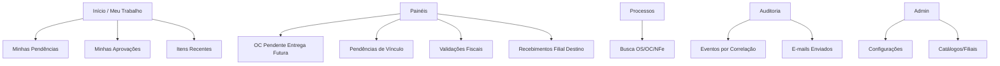
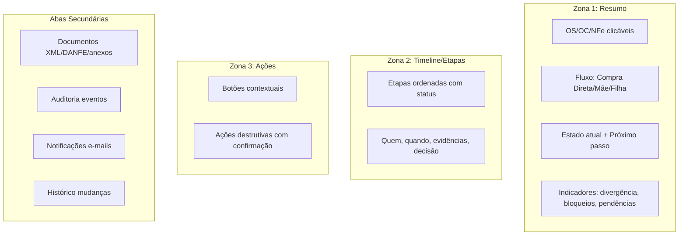
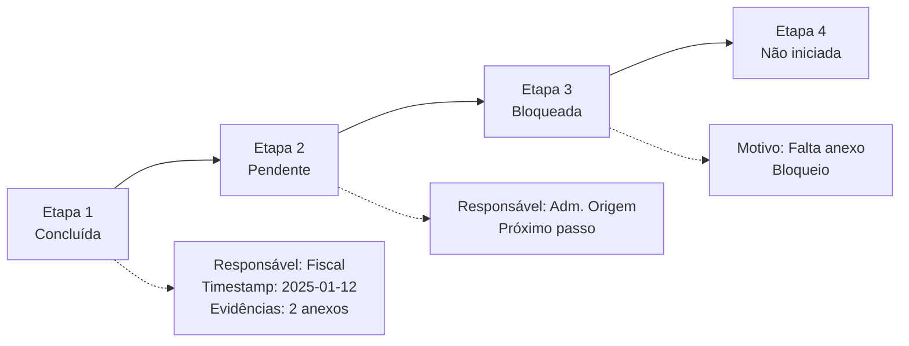
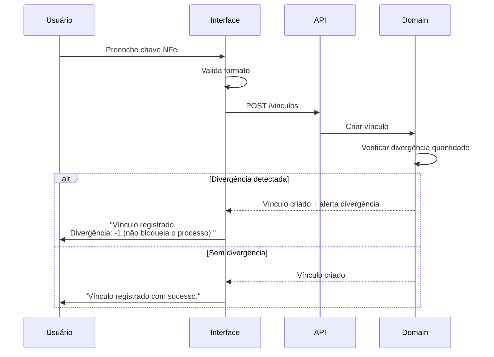

# Guia de Design (UX/UI) — Rotina de Transferência de Materiais Entre Filiais

> **Guia de Design e Experiência do Usuário** — Princípios, padrões e componentes para interface consistente, eficiente e segura.
> Desenvolvido por **ness.**
> **Repositório:** [https://github.com/resper1965/nTransfer](https://github.com/resper1965/nTransfer)
> Referências: [SPEC.md](./specs/transferencia-materiais/SPEC.md), [ARCHITECTURE.md](./ARCHITECTURE.md), [OPERATIONS.md](./OPERATIONS.md)

## 1. Objetivo

Este guia define princípios, padrões e componentes para uma interface consistente, eficiente e segura para uma rotina operacional baseada em workflow. O foco é:

- Reduzir erros (vínculo, validação, anexos)
- Acelerar decisões (fila de trabalho por papel)
- Aumentar rastreabilidade (auditoria e histórico)
- Tornar exceções "gerenciáveis" (pendências e retentativas)

## 2. Princípios de UX (Prioridade Operacional)

1. **Clareza antes de completude**
   - Em telas operacionais, mostre o mínimo necessário para decidir e agir.

2. **Fila de trabalho por papel**
   - O usuário deve começar o dia pela "minha fila", não por menus.

3. **Estados explícitos**
   - Sempre mostrar estado atual, próximo passo, responsável e bloqueios.

4. **Erros como parte do fluxo**
   - "NFe incorreta", "erro de vínculo", "falta de anexo" devem ser estados tratáveis, com orientação e ações claras.

5. **Rastreabilidade por padrão**
   - Cada ação relevante deve gerar um registro visível (audit trail) e uma confirmação adequada.

6. **Prevenção > correção**
   - Validar cedo, com mensagens úteis e exemplos. Evitar retrabalho.

## 3. Heurísticas e Boas Práticas (Checklist)

- **Reconhecimento em vez de memorização**
  - Menos códigos, mais labels e "tooltips" (sem poluir).

- **Progressive disclosure**
  - Detalhes fiscais/XML/auditoria em abas/expansores, não no primeiro viewport.

- **Consistência**
  - Mesmas cores, ícones e termos para estados/ações em toda a aplicação.

- **Feedback imediato**
  - Toda ação (aprovar, reprovar, anexar, vincular) precisa de confirmação, loading e resultado.

- **Eficiência**
  - Teclado, filtros persistentes, atalhos, ações em massa quando fizer sentido.

- **Acessibilidade**
  - Contraste, foco visível, navegação por teclado, textos alternativos e ARIA.

## 4. Arquitetura da Informação (IA)

### 4.1 Estrutura Recomendada (Navegação)



**Estrutura:**
- **Início / Meu Trabalho**
  - Minhas Pendências (cards por tipo)
  - Minhas Aprovações
  - Itens Recentes
- **Painéis**
  - OC Pendente de Entrega Futura ([RF-07](./specs/transferencia-materiais/SPEC.md#requisitos-funcionais-rf))
  - Pendências de Vínculo
  - Validações Fiscais
  - Recebimentos (Filial Destino)
- **Processos**
  - Busca por OS / OC / NFe (chave)
- **Auditoria**
  - Eventos por correlação ([RF-08](./specs/transferencia-materiais/SPEC.md#requisitos-funcionais-rf))
  - E-mails enviados
- **Admin (restrito)**
  - Configurações (policies, templates de e-mail, perfis)
  - Catálogos/filiais (se existir)

### 4.2 Conceito Central: "Processo"

A UI deve tratar OS/OC/NFe como **um processo correlacionado**. Em qualquer tela, permitir:

- Abrir o **Detalhe do Processo** (timeline)
- Ver **pendências** e **bloqueios**
- Executar **próxima ação válida** conforme papel

## 5. Padrões de Telas (Obrigatórios)

### 5.1 Painel (Lista) — Padrão

**Objetivo:** Triagem e ação rápida.

**Elementos:**
- **Cabeçalho**: título + contadores (ex.: Pendentes / Em atraso / Com bloqueio)
- **Filtros**: filial, tipo de fluxo, estado, data, "meus itens"
- **Tabela** (ou lista) com colunas essenciais:
  - Identificador (OS/OC/NFe)
  - Estado atual
  - Próximo passo / responsável
  - SLA / vencimento (quando aplicável)
  - Bloqueios (badge)
  - Ações rápidas (quando seguras)
- **Ações em lote**: somente quando não houver risco (ex.: enviar lembrete, exportar)

**Boas práticas:**
- Paginação + busca incremental
- Filtros "sticky" (persistir localmente)
- Estados com badge e legenda consistente

### 5.2 Detalhe do Processo — Padrão

**Objetivo:** Entendimento e ação.

**Layout recomendado (3 zonas):**



1. **Resumo** (topo)
   - OS/OC/NFe (clicáveis)
   - Fluxo (Compra Direta / Mãe / Filha)
   - Estado atual + próximo passo
   - Indicadores: divergência de quantidade, bloqueios, pendências

2. **Timeline / Etapas**
   - Etapas ordenadas com status (concluída/pendente/bloqueada/reprovada/cancelada)
   - Cada etapa: quem, quando, evidências, decisão

3. **Ações**
   - Botões contextuais (ex.: "Registrar validação fiscal", "Criar vínculo", "Anexar evidência")
   - Ações destrutivas exigem confirmação + motivo

**Aba/Seções secundárias:**
- Documentos (XML/DANFE/anexos)
- Auditoria (eventos)
- Notificações (e-mails)
- Histórico de mudanças

### 5.3 Formulários — Padrão

- Validação inline + resumo no topo se necessário
- Campos com exemplos (placeholder) quando o formato é crítico (ex.: chave NFe)
- Campos condicionais (ex.: motivo aparece apenas em reprova/incorreta)
- Botões: **Primário (1)**, Secundário, Terciário (link)
- Não permitir submit com erros; focar automaticamente no primeiro erro

## 6. Estados e Semântica Visual (Design System Mínimo)

### 6.1 Estados de Processo (Badges)

Definir um conjunto fixo de status com:
- Label curto (1–2 palavras)
- Descrição (tooltip)
- Severidade (informativa / atenção / crítica)

**Recomendação de semântica** (sem amarrar cor):

| Estado | Severidade | Descrição |
|--------|------------|-----------|
| **Concluído** | Positivo | Processo finalizado com sucesso |
| **Pendente** | Neutro | Aguardando ação |
| **Em validação** | Informativo | Em processo de validação |
| **Bloqueado** | Atenção | Bloqueado por pendência ou erro |
| **Reprovado / Incorreto** | Crítico | Requer correção |
| **Cancelado** | Neutro/Explicativo | Processo cancelado |

### 6.2 Estados de Componente

- Default
- Hover
- Focus (visível)
- Disabled
- Loading (skeleton/spinner)
- Success/Warning/Error

## 7. Componentes Essenciais (Comportamento Esperado)

### 7.1 Tabela Operacional

- Colunas fixas + colunas configuráveis
- Ordenação por SLA/estado
- Linha clicável para abrir detalhe
- Ação rápida sempre com confirmação quando impacta estado

### 7.2 Timeline (Workflow)



**Etapas com:**
- Nome da etapa
- Status
- Responsável (papel)
- Timestamp (quando aplicável)
- Evidências anexadas (chips)
- "Ver detalhes" (expansor)

### 7.3 Modal de Decisão (Aprovar/Reprovar / Correta/Incorreta)

**Campos:**
- Decisão (radio)
- Motivo (obrigatório para reprova/incorreta)
- Comentário (opcional)

**Confirmação final** com resumo do impacto ("isso abrirá pendência e notificará X")

### 7.4 Upload / Evidências

- Suporte a múltiplos arquivos
- Mostrar regras (obrigatório no destino — [RB-04](./specs/transferencia-materiais/SPEC.md#regras-de-negócio-rb)) e tipos aceitos
- Upload resiliente (retentativa)
- Registro de quem anexou + quando + tipo
- Previews simples (nome/tamanho) e link para download

### 7.5 Notificações (E-mail) e Histórico

- Log de envio: destinatários, assunto, status (enviado/falhou), horário
- Ação "reenviar" restrita e auditada (se permitido)

## 8. Microcopy e Linguagem (Português Claro, Operacional)

**Regras:**
- Use verbos de ação: "Vincular", "Validar", "Anexar", "Aprovar", "Reprovar"
- Mensagens de erro devem dizer:
  1) o que aconteceu
  2) por que importa
  3) como corrigir

**Exemplos:**
- "Anexo obrigatório: inclua ao menos um documento para concluir o recebimento." ([RB-04](./specs/transferencia-materiais/SPEC.md#regras-de-negócio-rb))
- "NFe marcada como incorreta. Informe o motivo para abrir a pendência de correção." ([RB-05](./specs/transferencia-materiais/SPEC.md#regras-de-negócio-rb))

## 9. Fluxos Críticos (UX Detalhado)

### 9.1 Vínculo OS ↔ NFe



- Campo chave NFe com máscara/validação
- Exibir divergência de quantidade como **alerta não bloqueante**
- Confirmação: "Vínculo registrado. Divergência: -1 (não bloqueia o processo)." ([RB-03](./specs/transferencia-materiais/SPEC.md#regras-de-negócio-rb))

### 9.2 Validação Fiscal "NFe correta?"

- Decisão em modal dedicado
- Se "incorreta": motivo obrigatório com categoria + detalhe ([RB-05](./specs/transferencia-materiais/SPEC.md#regras-de-negócio-rb))
- Após salvar: navegar para tela de pendência com próximos passos

### 9.3 Recebimento na Filial Destino (Anexo Obrigatório)

```mermaid
flowchart TD
  A[Usuário tenta concluir recebimento] --> B{Anexos presentes?}
  B -->|Não| C[Bloquear ação]
  C --> D[Exibir mensagem:<br/>"Anexo obrigatório: inclua ao menos<br/>um documento para concluir o recebimento."]
  D --> E[Orientar: "NFe assinada como conferida"]
  B -->|Sim| F[Permitir conclusão]
  F --> G[Registrar evento de auditoria]
  G --> H[Exibir confirmação]
```

- Antes de concluir: verificar anexos
- Se faltante: bloquear e orientar exatamente o que anexar (ex.: "NFe assinada como conferida")
- Ao concluir: registrar evento e exibir confirmação ([RB-04](./specs/transferencia-materiais/SPEC.md#regras-de-negócio-rb))

## 10. Acessibilidade (Mínimo Obrigatório)

- Contraste adequado (WCAG AA como meta)
- Navegação por teclado:
  - Tab order lógico
  - Modais com foco preso
- Labels associados a inputs
- Mensagens de erro com ARIA-live
- Não depender exclusivamente de cor para status (use ícone/label)

## 11. Responsividade

- Desktop-first (operacional), mas suportar tablet
- Em telas pequenas:
  - Tabelas viram cards com campos principais
  - Ações ficam em menu "Mais ações"
- Evitar modais gigantes; preferir drawers em mobile/tablet

## 12. Performance e Escalabilidade de UI

- Paginação no servidor para listas grandes
- Debounce na busca
- Carregamento incremental no detalhe (abas lazy)
- Skeletons (não "piscadas")

## 13. Segurança e UX

- RBAC refletido na UI ([RNF-03](./specs/transferencia-materiais/SPEC.md#requisitos-não-funcionais-rnf)):
  - Esconder ações não permitidas
  - Mas permitir visualizar estado e motivo
- Ações destrutivas:
  - Exigir confirmação
  - Exigir motivo quando aplicável
  - Logar/auditar sempre ([RNF-01](./specs/transferencia-materiais/SPEC.md#requisitos-não-funcionais-rnf))

## 14. Instrumentação (Métricas de UX)

**Eventos recomendados:**
- Tempo até concluir tarefa (por papel)
- Taxa de bloqueio por falta de anexo
- Taxa de re-trabalho por NFe incorreta (por categoria de motivo)
- Cliques em ações rápidas vs detalhe
- Tempo na tela de decisão fiscal

## 15. Entregáveis de Design (Para o Projeto)

- ✅ Mapa de navegação (IA) — Ver [Seção 4.1](#41-estrutura-recomendada-navegação)
- ⏳ Wireframes das telas padrão:
  - Meu Trabalho
  - Painel OC pendente
  - Painel Validação Fiscal
  - Detalhe do Processo
  - Recebimento (Destino) + Upload
- ⏳ Biblioteca de componentes (mínimo): tabela, badge, timeline, modal de decisão, upload, toast
- ⏳ Tokens (design tokens):
  - Tipografia, espaçamento, raios, elevação, ícones, estados

## 16. Definition of Done (DoD) para UI

Uma funcionalidade de UI só está pronta quando:

- ✅ Segue os padrões de tela e componente deste guia
- ✅ Possui estados loading/empty/error
- ✅ Possui validação e microcopy adequados
- ✅ Registra auditoria (quando ação altera estado)
- ✅ Respeita RBAC e acessibilidade mínima
- ✅ Possui ao menos teste de interface (unitário de componente ou e2e básico) quando aplicável

## 17. Referências e Relacionamentos

### Requisitos Relacionados

- **RF-04:** Gerenciar anexos e bloquear conclusão sem evidência ([SPEC.md](./specs/transferencia-materiais/SPEC.md#requisitos-funcionais-rf))
- **RF-07:** Painéis operacionais ([SPEC.md](./specs/transferencia-materiais/SPEC.md#requisitos-funcionais-rf))
- **RF-08:** Trilha de auditoria ([SPEC.md](./specs/transferencia-materiais/SPEC.md#requisitos-funcionais-rf))
- **RB-03:** Não travar por divergência de quantidade ([SPEC.md](./specs/transferencia-materiais/SPEC.md#regras-de-negócio-rb))
- **RB-04:** Anexo obrigatório na entrada destino ([SPEC.md](./specs/transferencia-materiais/SPEC.md#regras-de-negócio-rb))
- **RB-05:** Cancelar etapas anteriores quando NFe incorreta ([SPEC.md](./specs/transferencia-materiais/SPEC.md#regras-de-negócio-rb))
- **RNF-01:** Auditoria imutável ([SPEC.md](./specs/transferencia-materiais/SPEC.md#requisitos-não-funcionais-rnf))
- **RNF-03:** RBAC mínimo por papel ([SPEC.md](./specs/transferencia-materiais/SPEC.md#requisitos-não-funcionais-rnf))

### Documentos Relacionados

- [ARCHITECTURE.md](./ARCHITECTURE.md) — Arquitetura técnica da aplicação
- [OPERATIONS.md](./OPERATIONS.md) — Operação e painéis
- [diagrams.md](./specs/transferencia-materiais/diagrams.md) — Diagramas de fluxo e estados
