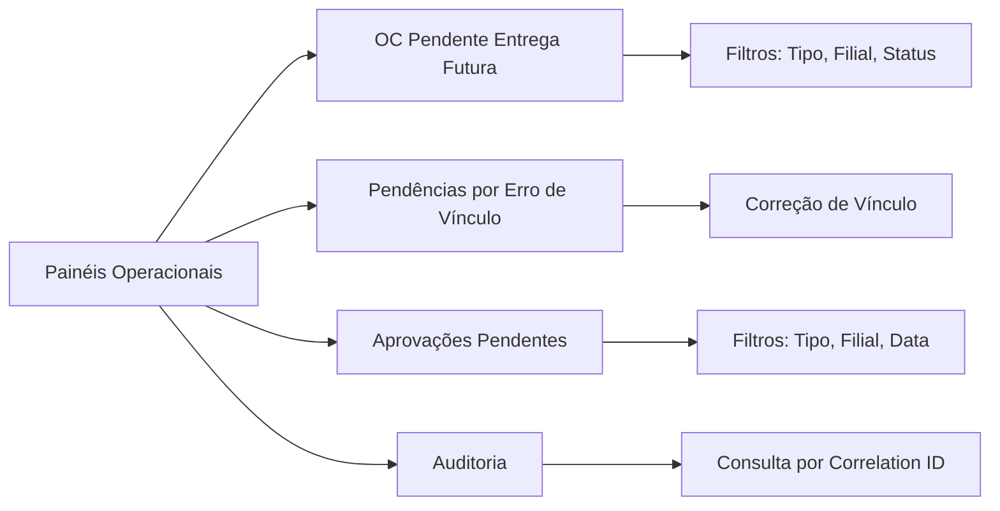

# Operação — Transferência de Materiais Entre Filiais

> **Operação e Governança** — Painéis, notificações, SLAs, auditoria, retentativas e idempotência.
> Desenvolvido por **ness.**
> **Repositório:** [https://github.com/resper1965/nTransfer](https://github.com/resper1965/nTransfer)
> Referências: [SPEC.md](./specs/transferencia-materiais/SPEC.md), [ARCHITECTURE.md](./ARCHITECTURE.md), [openapi.yaml](./contracts/openapi.yaml)

## 1. Painéis Operacionais



### 1.1 OC Pendente de Entrega Futura

**Requisito:** [RF-07](./specs/transferencia-materiais/SPEC.md#requisitos-funcionais-rf)  
**Endpoint:** `GET /paineis/oc-pendente-entrega-futura` ([openapi.yaml](./contracts/openapi.yaml#L163))

**Funcionalidades:**
- Listar OCs pendentes de entrega futura (mãe e filha)
- Filtros: tipo (mãe/filha), filial destino, status
- Exibir: OC ID, OS ID, status, data estimada, dias pendente

**Uso:**
- Gestor do Contrato acompanha pendências
- Adm. Filial Origem identifica OCs para processar remessa

### 1.2 Pendências por Erro de Vínculo

**Requisito:** [RF-07](./specs/transferencia-materiais/SPEC.md#requisitos-funcionais-rf)

**Funcionalidades:**
- Listar processos com erro de vínculo
- Exibir: OS ID, NFe chave, motivo do erro, data do erro
- Permitir correção de vínculo

**Uso:**
- Adm. Filial Origem corrige vínculos incorretos

### 1.3 Aprovações Pendentes

**Requisito:** [RF-07](./specs/transferencia-materiais/SPEC.md#requisitos-funcionais-rf)

**Funcionalidades:**
- Listar aprovações pendentes (entrega, medição, vínculo)
- Filtros: tipo, filial, data
- Exibir: ID aprovação, tipo, OS/OC/NFe relacionada, responsável

**Uso:**
- Gestor do Contrato acompanha aprovações
- Atores identificam pendências de sua responsabilidade

## 2. Notificações por E-mail

### 2.1 Objetivo

Padronizar disparos, destinatários, conteúdo e rastreabilidade das notificações por e-mail, garantindo previsibilidade operacional.

**Requisito:** [RF-06](./specs/transferencia-materiais/SPEC.md#requisitos-funcionais-rf)  
**Decisão:** [DEC-02](./specs/transferencia-materiais/TBD.md#decisões-fechadas) — Notificações via e-mail

**Referências:**
- Templates: [`docs/contracts/email-templates.md`](./contracts/email-templates.md)
- Catálogo de auditoria: [`docs/contracts/auditoria-eventos.md`](./contracts/auditoria-eventos.md)
- Modelo de dados: [`docs/data-models/data-model.md`](./data-models/data-model.md) (`notificacao_email`)

---

### 2.2 Tipos de notificação (catálogo)

Os tipos de notificação correspondem ao enum `NotificacaoTipo` e aos templates definidos em [`docs/contracts/email-templates.md`](./contracts/email-templates.md).

**Tipos (MVP):**
- `CHEGADA_MATERIAL`
- `NFE_ENTRADA_DISPONIVEL`
- `NFE_SAIDA_PRONTA_IMPRESSAO`
- `CANCELAMENTO_PROCESSO`
- `PENDENCIA_ABERTA`
- `LEMBRETE_7_DIAS_ENTREGA_ESTIMADA`
- `LEMBRETE_30_DIAS_DESTINO`
- `MEDICAO_CONCLUIDA` (TBD-04 fechado: medição no RM/Contratos, atualizado via integração)

---

### 2.3 Destinatários por tipo (LAC-10)

> **Regra:** destinatários são definidos por PAPEL (role) e resolvidos para e-mails por meio de uma fonte de contatos (TBD-?? se necessário).  
> Enquanto não houver fonte corporativa definitiva, implementar **tabela/config interna** com mapeamento `filialId + role → emails`.

#### Tabela de destinatários

| NotificacaoTipo | Destinatários (papel) | Critério de seleção | Observações |
|---|---|---|---|
| `CHEGADA_MATERIAL` | Adm. Filial Destino | `os.filialDestinoId` | Disparada quando chegada é registrada |
| `NFE_ENTRADA_DISPONIVEL` | Adm. Filial Destino | `os.filialDestinoId` | Disparada quando XML/NFe de entrada está disponível |
| `NFE_SAIDA_PRONTA_IMPRESSAO` | Adm. Filial Origem | `os.filialOrigemId` (se existir) ou regra alternativa [TBD] | Se `filialOrigemId` não existir no modelo, usar contato de origem por OC/NFe |
| `CANCELAMENTO_PROCESSO` | Gestor do Contrato + Adm. Filial Destino | `os.filialDestinoId` + "gestor" global | Notificar impacto operacional e encerramento |
| `PENDENCIA_ABERTA` | Dono da pendência (OwnerRole) + Gestor do Contrato (opcional) | `pendencia.ownerRole` e `os.filialDestinoId` | Recomendado: "owner" sempre no TO e gestor em CC |
| `LEMBRETE_7_DIAS_ENTREGA_ESTIMADA` | Gestor do Contrato + Adm. Filial Destino | `os.dataEstimadaEntrega` e `os.filialDestinoId` | Somente fluxo F2 (mãe) |
| `LEMBRETE_30_DIAS_DESTINO` | Gestor do Contrato + Adm. Filial Destino | Baseado em "tempo em estado" no destino | Somente quando existir backlog no destino |
| `MEDICAO_CONCLUIDA` | Gestor do Contrato + Adm. Filial (destino/origem conforme fluxo) | Medição concluída no RM/Contratos (TBD-04 fechado) | Disparada quando integração RM atualiza estado para MEDICAO_APROVADA/MEDICAO_REPROVADA |

#### Resolução de destinatários (MVP)

Implementar uma função/serviço `ResolveRecipients(correlation, tipo, contexto)`:

- **Entrada mínima:**
  - `osId`, `osNumero`, `filialDestinoId`, `ownerRole?`
- **Saída:**
  - `to[]`, `cc[]`
- **Fonte:**
  - `RecipientsConfig` (ex.: tabela interna, json de configuração, ou banco)
- **Regras:**
  - deduplicar e-mails
  - validar formato básico
  - se `to[]` estiver vazio: abrir pendência `INTEGRACAO_FALHOU` ou registrar erro operacional e não enviar (evitar "e-mail para ninguém")

---

### 2.4 Pontos de disparo (gatilhos)

> Todo disparo gera:
> 1) registro em `notificacao_email` com status `ENFILEIRADA`
> 2) evento de auditoria `NOTIFICACAO_ENFILEIRADA`
> 3) tentativa de envio (sync/async) que gera `NOTIFICACAO_ENVIADA` ou `NOTIFICACAO_FALHOU`

| NotificacaoTipo | Evento/Condição de disparo | Artefatos correlatos |
|---|---|---|
| `CHEGADA_MATERIAL` | transição para `CHEGADA_MATERIAL_DESTINO` | auditoria: `CHEGADA_MATERIAL_DESTINO` + `NOTIFICACAO_ENFILEIRADA` |
| `NFE_ENTRADA_DISPONIVEL` | XML obtido + NFe identificada como "entrada" no contexto do processo | auditoria: `NFE_XML_OBTIDO` |
| `NFE_SAIDA_PRONTA_IMPRESSAO` | transição para `NFE_SAIDA_ORIGEM_EMITIDA` | auditoria: `NFE_SAIDA_ORIGEM_EMITIDA` |
| `CANCELAMENTO_PROCESSO` | transição para `PROCESSO_CANCELADO` | auditoria: `PROCESSO_CANCELADO` |
| `PENDENCIA_ABERTA` | criação de pendência (`pendencia.status=ABERTA`) | auditoria: `PENDENCIA_ABERTA` |
| `LEMBRETE_7_DIAS_ENTREGA_ESTIMADA` | job diário detecta OS com `dataEstimadaEntrega - hoje = 7` | auditoria: `NOTIFICACAO_ENFILEIRADA` (motivo=agendamento) |
| `LEMBRETE_30_DIAS_DESTINO` | job diário detecta OS em estados de destino por >= 30 dias | auditoria: `NOTIFICACAO_ENFILEIRADA` (motivo=agendamento) |
| `MEDICAO_CONCLUIDA` | Medição concluída no RM/Contratos (TBD-04 fechado) | auditoria: `MEDICAO_APROVADA`/`MEDICAO_REPROVADA` + `NOTIFICACAO_*` |

---

### 2.5 Regras de agrupamento e deduplicação

Objetivo: evitar "spam" e garantir legibilidade.

**Regra padrão (MVP):**
- 1 e-mail por evento relevante (ex.: pendência aberta, cancelamento, chegada).
- Exceção: lembretes agendados podem ser agrupados por filial/gestor, se necessário (fase 2).

**Deduplicação (obrigatória):**
- Chave de dedupe recomendada: `tipo + correlationType + correlationId + janela`.
- Janela sugerida:
  - eventos transacionais: 10 minutos
  - lembretes: 24 horas
- Se duplicado:
  - não enviar novamente
  - registrar em auditoria opcional (`NOTIFICACAO_ENFILEIRADA` com `dedupe=true`) ou apenas log interno

---

### 2.6 Formato e variáveis do conteúdo

- Assunto e corpo devem ser gerados a partir de [`docs/contracts/email-templates.md`](./contracts/email-templates.md).
- Variáveis mínimas que sempre devem estar disponíveis:
  - `{{processoUrl}}`, `{{correlationId}}`, `{{osNumero}}`, `{{filialDestinoId}}`, `{{statusWorkflow}}`
- Links devem ser absolutos e apontar:
  - "detalhe do processo" (ideal), ou
  - painel correspondente (MVP)

---

### 2.7 Confiabilidade (fila, retentativas e falhas)

> A implementação pode ser síncrona no MVP, mas o modelo de operação deve assumir falhas e retentativas.

**Estados:**
- `ENFILEIRADA` → `ENVIADA` ou `FALHOU`

**Retentativas (MVP):**
- 3 tentativas (ex.: 1 min, 5 min, 30 min) para falhas transitórias (SMTP/timeout).
- Falha definitiva:
  - manter registro `FALHOU` com campo `erro`
  - abrir pendência `INTEGRACAO_FALHOU` vinculada ao processo (correlationId)
  - gerar auditoria `NOTIFICACAO_FALHOU`

**Observabilidade mínima:**
- painel/consulta por `status=FALHOU`
- lista por `correlationId` no detalhe do processo

---

### 2.8 Rastreabilidade (auditoria)

Para cada notificação, os seguintes eventos devem existir:

**1) Ao criar registro:**
- `NOTIFICACAO_ENFILEIRADA` com payload:
  - `notificacaoId`, `tipo`, `to[]`, `subject`, `correlationId`

**2) Ao enviar com sucesso:**
- `NOTIFICACAO_ENVIADA` com payload:
  - `notificacaoId`, `providerMessageId`, `sentAt`

**3) Ao falhar:**
- `NOTIFICACAO_FALHOU` com payload:
  - `notificacaoId`, `erro`, `attempt`, `sentAt?`

**Referência:** [`docs/contracts/auditoria-eventos.md`](./contracts/auditoria-eventos.md)

---

### 2.9 TBDs relacionados

- **Integração (origem/destino de contatos):** TBD (fonte de e-mails por filial/papel)
- **Aprovação de entrega (TBD-03):** pode introduzir notificações adicionais (ex.: `APROVACAO_PENDENTE`)
- **Medição (TBD-04 fechado):** medição realizada no RM/Contratos; estados atualizados via integração; notificação `MEDICAO_CONCLUIDA` disparada quando medição concluída

## 3. SLAs Operacionais

**Requisito:** [NFR-06](./specs/transferencia-materiais/SPEC.md#requisitos-não-funcionais-rnf) (proposto)

**SLAs propostos:**
- **Painéis:** atualização em tempo real (eventos processados imediatamente)
- **E-mails:** disparo em até 5 minutos após evento (exceto alertas 7/30 dias que são agendados)
- **Validação fiscal:** tempo médio entre "XML obtido" → "NFe validada" (métrica)

## 4. Auditoria

**Requisito:** [RNF-01](./specs/transferencia-materiais/SPEC.md#requisitos-não-funcionais-rnf) — Auditoria imutável

**Catálogo de Eventos:** Ver [auditoria-eventos.md](./contracts/auditoria-eventos.md) para payload mínimo por tipo de evento (22 tipos documentados).

### 4.1 Eventos Auditados

**Toda transição de estado:**
- Estado anterior, estado novo, transição, usuário, timestamp
- Evento: `WORKFLOW_TRANSICAO`

**Toda decisão:**
- "NFe correta?" — decisão, motivo (se incorreta), fiscal
- Evento: `FISCAL_NFE_VALIDADA`
- Aprovação/reprovação — tipo, decisão, motivo (se reprovada), aprovador

**Toda integração:**
- Origem (Qive/RM), destino, evento, status (sucesso/erro), correlation-id externo

**Toda notificação:**
- Tipo, destinatário, status envio, correlation-id

### 4.2 Consulta de Auditoria

**Endpoint:** `GET /auditoria?correlationId={osId|ocId|nfeChaveAcesso}` ([openapi.yaml](./contracts/openapi.yaml#L178))

**Retorna:**
- Lista de eventos ordenada por timestamp
- Filtros: eventType, actorRole, data range

**Uso:**
- Rastreabilidade completa de um processo
- Investigação de problemas
- Compliance e auditoria externa

## 5. Retentativas e Resiliência

**Requisito:** [RNF-05](./specs/transferencia-materiais/SPEC.md#requisitos-não-funcionais-rnf) — Resiliência

### 5.1 Falhas de Integração

**Comportamento:**
- Falha em integração Qive↔RM não interrompe o workflow
- Sistema cria pendência com:
  - Tipo de falha
  - Payload recebido (mínimo)
  - Correlation-id
  - Timestamp
- Permite retentativa manual

**Pendências:**
- Listadas em painel de pendências
- Podem ser reprocessadas manualmente
- Mantêm histórico de tentativas

### 5.2 Falhas de E-mail

**Comportamento:**
- Falha no envio de e-mail não bloqueia o processo
- Registra falha na auditoria
- Permite reenvio manual

## 6. Idempotência

**Requisito:** [RNF-02](./specs/transferencia-materiais/SPEC.md#requisitos-não-funcionais-rnf) — Idempotência nas integrações

### 6.1 Chave Idempotente

**Integração Qive↔RM:**
- Chave idempotente: `chaveAcesso` da NFe
- Mesma chave não duplica efeitos
- Retorna resultado do processamento anterior se já processado

**Endpoint:** `POST /integrations/qive/nfe-recebida` ([openapi.yaml](./contracts/openapi.yaml#L175))
- Campo `idempotencyKey` obrigatório
- Sugestão: usar `chaveAcesso` como `idempotencyKey`

### 6.2 Validação

**Teste de idempotência:**
- Enviar mesmo evento duas vezes
- Verificar que não duplica registros
- Verificar que retorna mesmo resultado

## 7. Monitoramento e Observabilidade

**Requisito:** [RNF-04](./specs/transferencia-materiais/SPEC.md#requisitos-não-funcionais-rnf) — Observabilidade

### 7.1 Logs Estruturados

**Formato:** JSON com correlation-id

**Campos obrigatórios:**
- `correlationId`: OS/OC/NFe
- `eventType`: tipo de evento
- `level`: Information/Warning/Error
- `message`: mensagem descritiva
- `timestamp`: ISO 8601

**Exemplo:**
```json
{
  "correlationId": "os_01JABC...",
  "eventType": "VINCULO_CRIADO",
  "level": "Information",
  "message": "Vínculo criado entre OS e NFe",
  "timestamp": "2025-01-12T10:00:00Z"
}
```

### 7.2 Métricas (Futuro)

**KPIs propostos:**
- % de processos com pendência por erro de vínculo
- Tempo médio entre "XML obtido" → "NFe validada"
- Tempo médio entre "NFe saída pronta" → "Entrada destino concluída"
- % de entradas destino bloqueadas por falta de anexo
- Volume de cancelamentos por "NFe incorreta" por categoria

## 8. Troubleshooting

### 8.1 Problemas Comuns

**Erro de vínculo:**
- Verificar painel de pendências
- Corrigir vínculo manualmente
- Verificar auditoria para entender origem do erro

**NFe incorreta:**
- Verificar motivo registrado na auditoria
- Cancelar etapas anteriores
- Orientar fabricante a emitir nova NFe

**Falha de integração:**
- Verificar pendências
- Reprocessar manualmente
- Verificar logs com correlation-id

**E-mail não enviado:**
- Verificar auditoria de notificações
- Verificar configuração SMTP/Mailpit
- Reenviar manualmente se necessário

### 8.2 Consultas Úteis

**Auditoria completa de um processo:**
```
GET /auditoria?correlationId=os_01JABC...
```

**Eventos de integração:**
```
GET /auditoria?correlationId=3525...123&eventType=integracao
```

**Notificações enviadas:**
```
GET /auditoria?correlationId=os_01JABC...&eventType=notificacao
```
