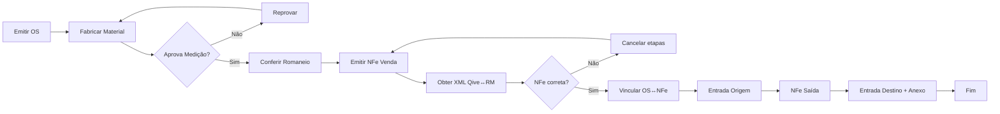

# PRD — Rotina de Transferência de Materiais Entre Filiais

> **Product Requirements Document** — Requisitos funcionais e não funcionais do produto.
> Desenvolvido por **ness.**
> **Repositório:** [https://github.com/resper1965/nTransfer](https://github.com/resper1965/nTransfer)
> Referências: [SPEC.md](./specs/transferencia-materiais/SPEC.md), [PROJECT_MAP.md](./specs/transferencia-materiais/PROJECT_MAP.md), [diagrams.md](./specs/transferencia-materiais/diagrams.md)

## 1. Resumo Executivo

Esta rotina adicional (camada complementar) orquestra, registra, audita e notifica o processo de transferência de materiais entre filiais, suportando três fluxos operacionais:

- **F1: Compra Direta** — Fluxo completo de fabricação até entrega
- **F2: Entrega Futura (mãe)** — Faturamento antecipado sem atualização de estoque
- **F3: Entrega Futura (filha)** — Remessa efetiva após entrega futura

A rotina **não substitui** RM/RM nFlow/Qive; ela organiza o trabalho (papéis, pendências, anexos, aprovações) e reduz falhas (ex.: erro de vínculo, NFe incorreta, falta de evidência).

## 2. Problema e Contexto

O fluxo atual envolve múltiplas áreas (contratos, fiscal, administrativo de filial, fábrica/inspetor, fabricante, financeiro) e depende de etapas coordenadas com documentos fiscais (NFe/XML/DANFE), vínculos (OS/OC/NFe) e ações que não devem travar o processo em casos comuns.

**Regras explícitas do processo** que precisam ser enforçadas e rastreadas:**

- Cada OS vincula uma ou mais NFe ([RB-01](./specs/transferencia-materiais/SPEC.md#regras-de-negócio-rb))
- A OS contém Filial Destino 1:1 e Quantidade, e o sistema não deve travar se houver diferença de quantidade (+/-) no vínculo ([RB-03](./specs/transferencia-materiais/SPEC.md#regras-de-negócio-rb))
- A decisão fiscal "NFe correta?" pode exigir cancelar etapas anteriores e registrar motivo ([RB-05](./specs/transferencia-materiais/SPEC.md#regras-de-negócio-rb))
- Em Compra Direta e Entrega Futura (filha) há atualização de Estoque Não Contábil ([RB-07](./specs/transferencia-materiais/SPEC.md#regras-de-negócio-rb))
- No recebimento pela Filial Destino, ao menos um anexo é obrigatório ([RB-04](./specs/transferencia-materiais/SPEC.md#regras-de-negócio-rb))
- Há notificações e prazos operacionais: "7 dias para entrega estimada" (mãe) e alerta "30 dias" (destino) ([RB-09](./specs/transferencia-materiais/SPEC.md#regras-de-negócio-rb), [RB-10](./specs/transferencia-materiais/SPEC.md#regras-de-negócio-rb))
- O fluxo depende de Integração Qive ↔ RM para obter XML/status ([TBD-01](./specs/transferencia-materiais/TBD.md#tbd-01--mecanismo-de-integração-qive--rm))

## 3. Objetivos (Goals)

**G1.** Reduzir erros operacionais de vínculo OS/OC/NFe e padronizar correções (incluindo "erro de vínculo").  
**G2.** Aumentar rastreabilidade e auditabilidade ponta a ponta (quem fez o quê, quando, por qual motivo).  
**G3.** Assegurar "gates" obrigatórios (ex.: anexo obrigatório na entrada destino).  
**G4.** Diminuir retrabalho via painéis de pendência e notificações por e-mail (eventos e prazos).

## 4. Não-objetivos (Non-goals)

- Não substituir RM, RM nFlow ou Qive (sistema-of-record permanece externo) — [DEC-01](./specs/transferencia-materiais/TBD.md#decisões-fechadas)
- Não definir regras fiscais/CFOP/tributação (somente orquestrar o processo e registrar decisões)
- Não "inventar" automações de integração: método Qive↔RM fica [TBD-01](./specs/transferencia-materiais/TBD.md#tbd-01--mecanismo-de-integração-qive--rm)

## 5. Stakeholders e Personas

### Papéis explícitos no fluxo

- **Gestor Aprovador do Contrato** — Acompanha aprovações, recebe alertas 7/30 dias
- **Administrativo Filial Origem** — Realiza vínculo OS↔NFe, trata correção de vínculo
- **Administrativo Filial Destino** — Confirma entrega (fluxo filha), ativa entrada de NFe, anexa comprovantes
- **Fiscal** — Obtém XML via Qive, valida "NFe correta?", sinaliza cancelamento e motivo
- **Financeiro** — Executa fluxo padrão de pagamentos (fora do escopo detalhado)
- **Fábrica / Inspetor** — Confere material/romaneio x carregamento
- **Fabricante** — Emite/cancela/reemite NFe (venda, entrega futura, remessa)

## 6. Escopo Funcional por Fluxo

### F1 — Compra Direta

Ver diagrama completo: [F1 — Compra Direta](./specs/transferencia-materiais/diagrams.md#f1--compra-direta-alto-nível)

**Passos principais:**
1. Emitir OS ([RF-01](./specs/transferencia-materiais/SPEC.md#requisitos-funcionais-rf))
2. Fabricar Material
3. Aprova Medição? (TBD-04)
4. Conferir Romaneio x Carregamento
5. Emitir NFe de Venda
6. Integração Qive ↔ RM: obter XML ([TBD-01](./specs/transferencia-materiais/TBD.md#tbd-01--mecanismo-de-integração-qive--rm))
7. Fiscal decide "NFe correta?" ([RF-03](./specs/transferencia-materiais/SPEC.md#requisitos-funcionais-rf), [RB-05](./specs/transferencia-materiais/SPEC.md#regras-de-negócio-rb))
8. Adm. Filial Origem vincula OS ↔ NFe ([RF-02](./specs/transferencia-materiais/SPEC.md#requisitos-funcionais-rf), [RB-01](./specs/transferencia-materiais/SPEC.md#regras-de-negócio-rb), [RB-03](./specs/transferencia-materiais/SPEC.md#regras-de-negócio-rb))
9. Receber NFe e atualizar estoque não contábil (origem) ([RF-05](./specs/transferencia-materiais/SPEC.md#requisitos-funcionais-rf), [RB-07](./specs/transferencia-materiais/SPEC.md#regras-de-negócio-rb))
10. Emitir NFe de Saída (baixa origem)
11. Receber NFe destino e atualizar estoque não contábil (destino) ([RF-05](./specs/transferencia-materiais/SPEC.md#requisitos-funcionais-rf))
12. Filial destino ativa entrada com anexo obrigatório ([RF-04](./specs/transferencia-materiais/SPEC.md#requisitos-funcionais-rf), [RB-04](./specs/transferencia-materiais/SPEC.md#regras-de-negócio-rb))
13. Alertas e avisos (incluindo 30 dias) ([RF-06](./specs/transferencia-materiais/SPEC.md#requisitos-funcionais-rf), [RB-09](./specs/transferencia-materiais/SPEC.md#regras-de-negócio-rb))

### F2 — Entrega Futura (mãe)

Ver diagrama completo: [F2 — Entrega Futura (mãe)](./specs/transferencia-materiais/diagrams.md#f2--entrega-futura-mãe--alto-nível)

**Passos principais:**
1. Atualizar OS com data estimada ([RF-01](./specs/transferencia-materiais/SPEC.md#requisitos-funcionais-rf))
2. Emissão de NFe para entrega futura pelo fabricante
3. Fiscal valida "NFe entrega futura correta?" com regra de cancelamento/motivo se incorreta ([RF-03](./specs/transferencia-materiais/SPEC.md#requisitos-funcionais-rf))
4. Receber NFe entrega futura **sem atualizar estoque**, entrada filial origem, e criar OC para receber remessa futura ([RF-05](./specs/transferencia-materiais/SPEC.md#requisitos-funcionais-rf), [RB-08](./specs/transferencia-materiais/SPEC.md#regras-de-negócio-rb))
5. Painel exibe OC pendente de entrega futura (vinculada) ([RF-07](./specs/transferencia-materiais/SPEC.md#requisitos-funcionais-rf))
6. Alertas: 7 dias para entrega estimada (avisar gestor) ([RF-06](./specs/transferencia-materiais/SPEC.md#requisitos-funcionais-rf), [RB-10](./specs/transferencia-materiais/SPEC.md#regras-de-negócio-rb))

### F3 — Entrega Futura (filha)

Ver diagrama completo: [F3 — Entrega Futura (filha)](./specs/transferencia-materiais/diagrams.md#f3--entrega-futura-filha--alto-nível)

**Passos principais:**
1. Confirmação em painel de OC pendente de entrega futura (vinculada) ([RF-07](./specs/transferencia-materiais/SPEC.md#requisitos-funcionais-rf))
2. Entrega efetiva aprovada e autorização de entrega (política "Aprova entrega?" = [TBD-03](./specs/transferencia-materiais/TBD.md#tbd-03--política-aprova-entrega)) ([RF-10](./specs/transferencia-materiais/SPEC.md#requisitos-funcionais-rf))
3. Inspetor confere romaneio x carregamento; fabricante emite NFe de remessa
4. Adm. Filial Origem complementa vínculo OS + OC entrega futura + NFe; ativa entrada NFe do material recebido ([RF-02](./specs/transferencia-materiais/SPEC.md#requisitos-funcionais-rf))
5. Fiscal valida NFe; se incorreta, cancelar etapas e registrar motivo ([RF-03](./specs/transferencia-materiais/SPEC.md#requisitos-funcionais-rf))
6. Atualizar estoque não contábil (origem e destino), emitir NFe saída (baixa origem), entrada destino com anexo obrigatório, alertas 30 dias, e-mails de chegada/material ([RF-05](./specs/transferencia-materiais/SPEC.md#requisitos-funcionais-rf), [RF-06](./specs/transferencia-materiais/SPEC.md#requisitos-funcionais-rf))

## 7. Principais Jornadas do Usuário

### J1 — Fiscal valida NFe (correta/incorreta)

**Trigger:** XML obtido do Qive (integrado ao RM) via [TBD-01](./specs/transferencia-materiais/TBD.md#tbd-01--mecanismo-de-integração-qive--rm).

**Ações:**
- Marcar correta/incorreta via endpoint [`POST /fiscal/nfe/{chaveAcesso}/validacao`](../contracts/openapi.yaml#L93)
- Se incorreta: registrar motivo e iniciar "cancelar etapas anteriores" ([RB-05](./specs/transferencia-materiais/SPEC.md#regras-de-negócio-rb))

**Validação:** [CA-02](./specs/transferencia-materiais/SPEC.md#critérios-de-aceite-ca)

### J2 — Administrativo origem realiza vínculo e correção de vínculo

**Ações:**
- Vincular OS com NFe(s) via endpoint [`POST /vinculos`](../contracts/openapi.yaml#L68) ([RF-02](./specs/transferencia-materiais/SPEC.md#requisitos-funcionais-rf))
- No fluxo filha: OS+OC+NFe ([RB-01](./specs/transferencia-materiais/SPEC.md#regras-de-negócio-rb))
- Não travar por divergência ([RB-03](./specs/transferencia-materiais/SPEC.md#regras-de-negócio-rb))

**Exceção:** "erro de vínculo" retorna para correção.

**Validação:** [CA-01](./specs/transferencia-materiais/SPEC.md#critérios-de-aceite-ca)

### J3 — Administrativo destino recebe material e conclui entrada com evidência

**Gate:** Anexar ao menos um documento ("NFe assinada como conferida") via endpoint [`POST /anexos`](../contracts/openapi.yaml#L139) ([RB-04](./specs/transferencia-materiais/SPEC.md#regras-de-negócio-rb)).

**Validação:** [CA-03](./specs/transferencia-materiais/SPEC.md#critérios-de-aceite-ca)

### J4 — Gestor acompanha medição e prazos

- Acompanhar aprovações de medição ([TBD-04](./specs/transferencia-materiais/TBD.md#tbd-04--medição-onde-ocorre-e-como-registrar))
- Medir contrato por NFe
- Receber alertas 7/30 dias ([RF-06](./specs/transferencia-materiais/SPEC.md#requisitos-funcionais-rf))

## 8. Requisitos Funcionais (Detalhados)

Ver [SPEC.md](./specs/transferencia-materiais/SPEC.md#requisitos-funcionais-rf) para lista completa.

**Resumo:**
- RF-01: Criar OS ([endpoint](../contracts/openapi.yaml#L21))
- RF-02: Registrar vínculo OS↔NFe ([endpoint](../contracts/openapi.yaml#L68))
- RF-03: Registrar validação fiscal ([endpoint](../contracts/openapi.yaml#L93))
- RF-04: Gerenciar anexos ([endpoint](../contracts/openapi.yaml#L139))
- RF-05: Registrar estoque não contábil
- RF-06: Notificações por e-mail ([DEC-02](./specs/transferencia-materiais/TBD.md#decisões-fechadas))
- RF-07: Painéis operacionais ([endpoint](../contracts/openapi.yaml#L163))
- RF-08: Trilha de auditoria ([endpoint](../contracts/openapi.yaml#L178))
- RF-09: Suportar "caminhão no local" ([TBD-07](./specs/transferencia-materiais/TBD.md#tbd-07--caminhão-no-local-como-identificar))
- RF-10: Suportar "aprova entrega?" ([TBD-03](./specs/transferencia-materiais/TBD.md#tbd-03--política-aprova-entrega))
- RF-11: Suportar "medição" ([TBD-04](./specs/transferencia-materiais/TBD.md#tbd-04--medição-onde-ocorre-e-como-registrar))

## 9. Requisitos Não Funcionais (NFR)

Ver [SPEC.md](./specs/transferencia-materiais/SPEC.md#requisitos-não-funcionais-rnf) para lista completa.

**Resumo:**
- NFR-01: Auditoria imutável ([RNF-01](./specs/transferencia-materiais/SPEC.md#requisitos-não-funcionais-rnf))
- NFR-02: Idempotência nas integrações ([RNF-02](./specs/transferencia-materiais/SPEC.md#requisitos-não-funcionais-rnf))
- NFR-03: Segurança/RBAC ([RNF-03](./specs/transferencia-materiais/SPEC.md#requisitos-não-funcionais-rnf))
- NFR-04: Observabilidade ([RNF-04](./specs/transferencia-materiais/SPEC.md#requisitos-não-funcionais-rnf))
- NFR-05: Auditabilidade ([RNF-05](./specs/transferencia-materiais/SPEC.md#requisitos-não-funcionais-rnf))
- NFR-06: SLA operacional (proposto: painéis e disparos de e-mail em janela configurável, exceto alertas 7/30 dias agendados)

## 10. Modelo de Dados (Alto Nível)

Ver [data-model.md](./data-models/data-model.md) para detalhes.

**Entidades mínimas:**
- OS, OC, NFe, Vínculo, Pendência, Aprovação, Anexo, Notificação, AuditoriaEvento

**Relações principais:**
- OS 1..N Vínculos (um OS vincula uma ou mais NFe) — [RB-01](./specs/transferencia-materiais/SPEC.md#regras-de-negócio-rb)
- Vínculo referencia NFe; no fluxo filha, também referencia OC

## 11. Integrações

**Qive ↔ RM ([TBD-01](./specs/transferencia-materiais/TBD.md#tbd-01--mecanismo-de-integração-qive--rm)):** obter XML e status de NFe (Qive integrado ao RM).

A rotina deve suportar:
- Ingestão de "NFe recebida" via endpoint [`POST /integrations/qive/nfe-recebida`](../contracts/openapi.yaml#L175)
- Consulta/atualização de status
- Correlação por chave de acesso NFe (idempotência)

## 12. UX / Telas (MVP)

Ver [DESIGN_GUIDE.md](./DESIGN_GUIDE.md) para detalhes completos de UX/UI.

**Painel "OC Pendente de Entrega Futura (Vinculada)"** (mãe e filha) — [RF-07](./specs/transferencia-materiais/SPEC.md#requisitos-funcionais-rf)  
**Detalhe do Processo (OS/OC/NFe):** linha do tempo + status + pendências  
**Fila Fiscal:** validação "NFe correta?" com motivo estruturado — [RF-03](./specs/transferencia-materiais/SPEC.md#requisitos-funcionais-rf)  
**Fila Adm Origem:** vínculos e correção de vínculo (com divergência de quantidade registrada) — [RF-02](./specs/transferencia-materiais/SPEC.md#requisitos-funcionais-rf)  
**Fila Adm Destino:** entrada com upload/registro de anexo obrigatório — [RF-04](./specs/transferencia-materiais/SPEC.md#requisitos-funcionais-rf)  
**Painel de Notificações/Auditoria:** lista de e-mails enviados + eventos por correlação — [RF-08](./specs/transferencia-materiais/SPEC.md#requisitos-funcionais-rf)

## 13. Métricas/KPIs

**% de processos com pendência por erro de vínculo** (deve cair ao longo do tempo)  
**Tempo médio entre "XML obtido" → "NFe validada"**  
**Tempo médio entre "NFe saída pronta" → "Entrada destino concluída"**  
**% de entradas destino bloqueadas por falta de anexo** (indica conformidade e treinamento)  
**Volume de cancelamentos por "NFe incorreta" por categoria de motivo**

## 14. Plano de Entrega (Proposto)

**Fase 0 — Documentação + dicionário + estados**
- Consolidar dicionário técnico ([TBD-02](./specs/transferencia-materiais/TBD.md#tbd-02--dicionário-técnico-de-movimentos-rm--nflow--qive)) e estados RM nFlow ([TBD-06](./specs/transferencia-materiais/TBD.md#tbd-06--mapeamento-técnico-de-estados-transições-no-rm-nflow)).

**Fase 1 — MVP operacional** (sem automações sofisticadas)
- Painéis, vínculo, validação fiscal, anexos, auditoria, notificações e-mail.

**Fase 2 — Integração "definitiva" Qive↔RM**
- Decidir método ([TBD-01](./specs/transferencia-materiais/TBD.md#tbd-01--mecanismo-de-integração-qive--rm)) e operacionalizar idempotência e reconciliação.

**Fase 3 — Fechamento de políticas**
- "Aprova entrega?" ([TBD-03](./specs/transferencia-materiais/TBD.md#tbd-03--política-aprova-entrega)) e "Medição" ([TBD-04](./specs/transferencia-materiais/TBD.md#tbd-04--medição-onde-ocorre-e-como-registrar)).

## 15. Riscos e Mitigação

- **Ambiguidade técnica de nFlow/movimentos** → mitigar com dicionário e mapeamento ([TBD-02](./specs/transferencia-materiais/TBD.md#tbd-02--dicionário-técnico-de-movimentos-rm--nflow--qive), [TBD-06](./specs/transferencia-materiais/TBD.md#tbd-06--mapeamento-técnico-de-estados-transições-no-rm-nflow)).
- **Integração indefinida Qive↔RM** → mitigar com adaptador e stubs; decisão posterior ([TBD-01](./specs/transferencia-materiais/TBD.md#tbd-01--mecanismo-de-integração-qive--rm)).
- **Processo possui passos "não sistêmicos"** → mitigar com inputs manuais auditáveis.
- **"Caminhão no local" aparece na legenda, mas a fonte do evento é indefinida** → [TBD-07](./specs/transferencia-materiais/TBD.md#tbd-07--caminhão-no-local-como-identificar).

## 16. TBD (Pendências Formais)

Todas as pendências estão centralizadas em [TBD.md](./specs/transferencia-materiais/TBD.md):
- TBD-01: Integração Qive↔RM (método)
- TBD-02: Dicionário técnico de movimentos RM/nFlow/Qive
- TBD-03: Política "Aprova entrega?"
- TBD-04: Medição (onde ocorre e como registrar)
- TBD-05: Stack técnico (fechado: .NET 8)
- TBD-06: Mapeamento técnico de estados RM nFlow
- TBD-07: "Caminhão no local" (origem do sinal)
