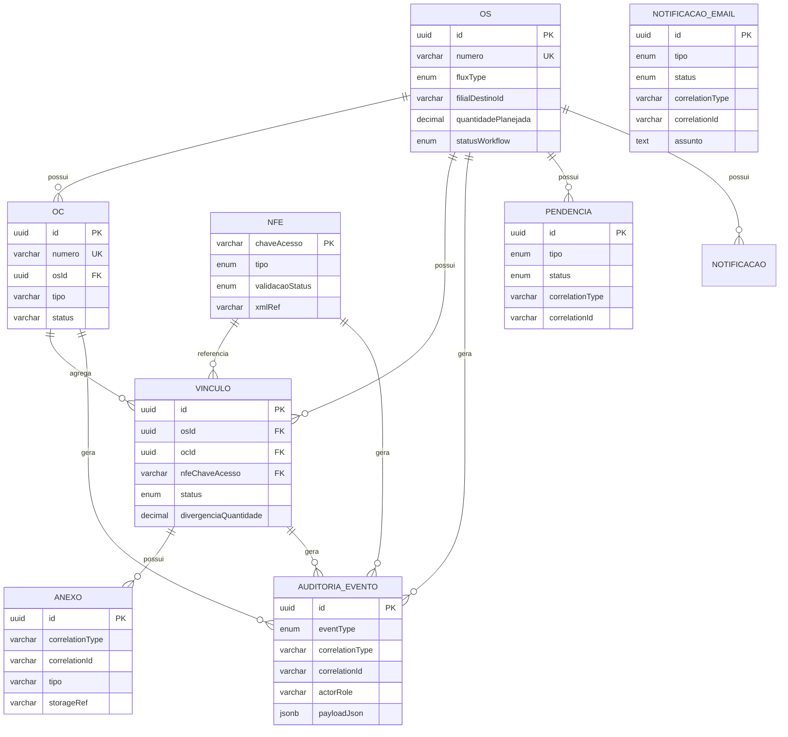

# Modelo de Dados — Transferência de Materiais Entre Filiais

> **Modelo de Dados Completo** — Entidades, campos, tipos, constraints, relacionamentos e índices.
> Data: 2025-01-12  
> Objetivo: especificar entidades, campos, tipos, constraints, relacionamentos e índices para suportar implementação (T02/T03/T04) sem ambiguidade.
> Referências: [SPEC.md](../specs/transferencia-materiais/SPEC.md), [openapi.yaml](../contracts/openapi.yaml), [diagrams.md](../specs/transferencia-materiais/diagrams.md)

## 1. Convenções

- **IDs internos:** `uuid` (GUID)
- **Datas:** `DateTimeOffset` em UTC
- **Quantidades:** `decimal(18,3)` (pode ser negativo em divergência)
- **Strings:**
  - `varchar(50/100/255)` conforme o campo
- **JSON:** `jsonb` (PostgreSQL) ou `nvarchar(max)` (SQL Server), dependendo do banco
- **Auditoria:** **append-only** (eventos nunca são atualizados, apenas inseridos)
- **Correlation:**
  - `correlationType` ∈ {`OS`, `OC`, `NFE`, `VINCULO`}
  - `correlationId` = ID natural do objeto (OS.id / OC.id / NFe.chaveAcesso / Vinculo.id)

## 2. Enums (Catálogo Canônico)

> Estes enums devem refletir exatamente os `components/schemas` do OpenAPI.

### 2.1 FluxType

- `COMPRA_DIRETA`
- `ENTREGA_FUTURA_MAE`
- `ENTREGA_FUTURA_FILHA`

### 2.2 WorkflowStatus (Canônico)

> **Fonte Única de Verdade:** Este enum é o catálogo canônico. Todos os documentos devem usar exclusivamente estes estados.
> 
> Para mapeamento por fluxo e normas de consistência, ver [workflow-states.md](../specs/transferencia-materiais/workflow-states.md).
> 
> Observação: "etapas" operacionais podem existir sem virar estado, mas aqui estão os estados necessários para coerência entre diagramas e API.

**Compartilhados:**
- `OS_CRIADA`
- `ROMANEIO_CONFERIDO`
- `NFE_EMITIDA`
- `XML_OBTIDO`
- `NFE_VALIDADA_OK`
- `NFE_VALIDADA_NOK`
- `CORRECAO_EMISSAO_OU_VINCULO`
- `VINCULO_CRIADO`
- `VINCULO_CORRIGIDO`
- `ENTRADA_DESTINO_PENDENTE_ANEXO`
- `ENTRADA_DESTINO_CONCLUIDA`
- `PROCESSO_CONCLUIDO`
- `PROCESSO_CANCELADO`

**F1 — Compra Direta:**
- `MATERIAL_FABRICADO`
- `ESTOQUE_ORIGEM_ATUALIZADO`
- `NFE_SAIDA_ORIGEM_EMITIDA`
- `EM_TRANSITO`
- `CHEGADA_MATERIAL_DESTINO`
- `ESTOQUE_DESTINO_ATUALIZADO`

**F2 — Entrega Futura (mãe):**
- `OS_ATUALIZADA_DATA_ESTIMADA`
- `NFE_ENTREGA_FUTURA_EMITIDA`
- `NFE_RECEBIDA_SEM_ESTOQUE`
- `OC_CRIADA_PARA_REMESSA`
- `AGUARDANDO_REMESSA`
- `ALERTA_7_DIAS_ENTREGA_ESTIMADA`

**F3 — Entrega Futura (filha):**
- `OC_PENDENTE_ENTREGA_FUTURA`
- `APROVACAO_ENTREGA_PENDENTE` (RB-11: GESTOR_CONTRATO sempre aprova)
- `ENTREGA_APROVADA`
- `ENTREGA_REPROVADA`
- `NFE_REMESSA_EMITIDA`
- `VINCULADA_OS_OC_NFE`
- `ENTRADA_ORIGEM_CONCLUIDA`
- `SAIDA_ORIGEM_CONCLUIDA`
- `ALERTA_30_DIAS_DESTINO`

**Medição (TBD-04 fechado):**
- `APROVACAO_MEDICAO_PENDENTE` — Medição pendente no RM/Contratos
- `MEDICAO_APROVADA` — Medição aprovada no RM/Contratos (atualizado via integração)
- `MEDICAO_REPROVADA` — Medição reprovada no RM/Contratos (atualizado via integração)

### 2.3 VinculoStatus

- `PENDENTE`
- `CRIADO`
- `ERRO_VINCULO`
- `CORRIGIDO`

### 2.4 NfeTipo

- `VENDA`
- `ENTREGA_FUTURA_MAE`
- `REMESSA_FILHA`
- `SAIDA_ORIGEM`
- `ENTRADA_DESTINO`

### 2.5 NfeValidacaoStatus

- `PENDENTE`
- `CORRETA`
- `INCORRETA`

### 2.6 NfeIncorretaMotivoCategoria

- `EMISSAO_NFE`
- `VINCULO_ADM_FILIAL`

### 2.7 PendenciaTipo

- `ERRO_VINCULO`
- `NFE_INCORRETA`
- `FALTA_ANEXO_OBRIGATORIO`
- `INTEGRACAO_FALHOU`
- `SEM_VINCULO_REMESSA`
- `ATRASO_ENTREGA_7_DIAS`
- `ATRASO_DESTINO_30_DIAS`
- `APROVACAO_PENDENTE` (RB-11: GESTOR_CONTRATO sempre aprova)
- `MEDICAO_PENDENTE` (TBD-04 fechado: medição no RM/Contratos)

### 2.8 PendenciaStatus

- `ABERTA`
- `EM_ANDAMENTO`
- `RESOLVIDA`
- `CANCELADA`

### 2.9 NotificacaoTipo

- `CHEGADA_MATERIAL`
- `NFE_ENTRADA_DISPONIVEL`
- `NFE_SAIDA_PRONTA_IMPRESSAO`
- `CANCELAMENTO_PROCESSO`
- `PENDENCIA_ABERTA`
- `LEMBRETE_7_DIAS_ENTREGA_ESTIMADA`
- `LEMBRETE_30_DIAS_DESTINO`
- `MEDICAO_CONCLUIDA` (TBD-04 fechado: medição no RM/Contratos)

### 2.10 NotificacaoStatus

- `ENFILEIRADA`
- `ENVIADA`
- `FALHOU`

### 2.11 AuditoriaEventType (Enum Canônico)

- `OS_CRIADA`
- `OS_DATA_ESTIMADA_ATUALIZADA`
- `MATERIAL_FABRICADO`
- `ROMANEIO_CONFERIDO`
- `NFE_EMITIDA`
- `NFE_XML_OBTIDO`
- `FISCAL_NFE_VALIDADA`
- `VINCULO_CRIADO`
- `VINCULO_CORRIGIDO`
- `ERRO_VINCULO_IDENTIFICADO`
- `ESTOQUE_ORIGEM_ATUALIZADO`
- `NFE_SAIDA_ORIGEM_EMITIDA`
- `CHEGADA_MATERIAL_DESTINO`
- `ANEXO_ADICIONADO`
- `ENTRADA_DESTINO_CONCLUIDA`
- `PENDENCIA_ABERTA`
- `PENDENCIA_RESOLVIDA`
- `NOTIFICACAO_ENFILEIRADA`
- `NOTIFICACAO_ENVIADA`
- `NOTIFICACAO_FALHOU`
- `WORKFLOW_TRANSICAO`
- `PROCESSO_CANCELADO`

## 3. Entidades (Estrutura Completa)

### 3.1 OS (Ordem de Serviço)

**Tabela:** `os`

| Campo | Tipo | Nullable | Constraints | Descrição |
|-------|------|----------|-------------|-----------|
| `id` | uuid | NOT NULL | PK | Identificador único |
| `numero` | varchar(50) | NOT NULL | UNIQUE | Número da OS (ex.: "OS-2025-000123") |
| `fluxType` | enum(FluxType) | NOT NULL | - | Tipo de fluxo (F1/F2/F3) |
| `filialDestinoId` | varchar(50) | NOT NULL | - | ID da filial destino ([RB-02](../specs/transferencia-materiais/SPEC.md#regras-de-negócio-rb)) |
| `quantidadePlanejada` | decimal(18,3) | NOT NULL | CHECK (> 0) | Quantidade planejada ([RB-02](../specs/transferencia-materiais/SPEC.md#regras-de-negócio-rb)) |
| `dataEstimadaEntrega` | date | NULL | - | Data estimada de entrega (F2) |
| `statusWorkflow` | enum(WorkflowStatus) | NOT NULL | - | Estado atual do workflow |
| `createdAt` | datetime | NOT NULL | - | Data de criação |
| `updatedAt` | datetime | NULL | - | Data de última atualização |

**Índices:**
- `idx_os_flux_status` (fluxType, statusWorkflow)
- `idx_os_filial_destino` (filialDestinoId)

**Regras de Negócio:**
- RB-02: OS contém filial destino 1:1 e quantidade
- RB-01: Cada OS vincula uma ou mais NFe

---

### 3.2 OC (Ordem de Compra)

**Tabela:** `oc`

| Campo | Tipo | Nullable | Constraints | Descrição |
|-------|------|----------|-------------|-----------|
| `id` | uuid | NOT NULL | PK | Identificador único |
| `numero` | varchar(50) | NOT NULL | UNIQUE | Número da OC |
| `osId` | uuid | NOT NULL | FK → os.id (RESTRICT) | Referência à OS |
| `tipo` | varchar(30) | NOT NULL | - | Tipo (ex.: `ENTREGA_FUTURA`) |
| `status` | varchar(30) | NOT NULL | - | Status (ex.: `PENDENTE_ENTREGA_FUTURA`, `VINCULADA`, `CONCLUIDA`, `CANCELADA`) |
| `createdAt` | datetime | NOT NULL | - | Data de criação |
| `updatedAt` | datetime | NULL | - | Data de última atualização |

**Índices:**
- `idx_oc_os_status` (osId, status)

**Regras de Negócio:**
- OC criada no fluxo F2 (entrega futura mãe) para receber remessa futura ([RB-08](../specs/transferencia-materiais/SPEC.md#regras-de-negócio-rb))

---

### 3.3 NFe

**Tabela:** `nfe`

| Campo | Tipo | Nullable | Constraints | Descrição |
|-------|------|----------|-------------|-----------|
| `chaveAcesso` | varchar(60) | NOT NULL | PK | Chave de acesso da NFe (identidade natural) |
| `tipo` | enum(NfeTipo) | NOT NULL | - | Tipo de NFe |
| `numero` | varchar(50) | NULL | - | Número da NFe |
| `serie` | varchar(20) | NULL | - | Série da NFe |
| `cnpjEmitente` | varchar(20) | NULL | - | CNPJ do emitente |
| `cnpjDestinatario` | varchar(20) | NULL | - | CNPJ do destinatário |
| `dataEmissao` | datetime | NULL | - | Data de emissão |
| `xmlRef` | varchar(255) | NULL | - | Referência ao XML armazenado |
| `validacaoStatus` | enum(NfeValidacaoStatus) | NOT NULL | DEFAULT `PENDENTE` | Status da validação fiscal |
| `motivoCategoria` | enum(NfeIncorretaMotivoCategoria) | NULL | - | Categoria do motivo (se incorreta) |
| `motivoDetalhe` | varchar(500) | NULL | - | Detalhe do motivo |
| `receivedAt` | datetime | NULL | - | Data de recebimento |
| `createdAt` | datetime | NOT NULL | - | Data de criação |
| `updatedAt` | datetime | NULL | - | Data de última atualização |

**Validações:**
- `chaveAcesso` deve ter formato válido (documentar regex no OpenAPI e validar no domínio)

**Índices:**
- `idx_nfe_tipo_status` (tipo, validacaoStatus)
- `idx_nfe_data_emissao` (dataEmissao)

**Regras de Negócio:**
- RB-05: Se "NFe correta?" = NÃO, cancelar etapas anteriores e detalhar motivo

---

### 3.4 Vínculo (OS/OC/NFe)

**Tabela:** `vinculo`

| Campo | Tipo | Nullable | Constraints | Descrição |
|-------|------|----------|-------------|-----------|
| `id` | uuid | NOT NULL | PK | Identificador único |
| `osId` | uuid | NOT NULL | FK → os.id (RESTRICT) | Referência à OS |
| `ocId` | uuid | NULL | FK → oc.id (RESTRICT) | Referência à OC (obrigatório no fluxo F3) |
| `nfeChaveAcesso` | varchar(60) | NOT NULL | FK → nfe.chaveAcesso (RESTRICT) | Referência à NFe |
| `status` | enum(VinculoStatus) | NOT NULL | DEFAULT `PENDENTE` | Status do vínculo |
| `divergenciaQuantidade` | decimal(18,3) | NULL | - | Divergência de quantidade (pode ser negativa; não bloqueante) ([RB-03](../specs/transferencia-materiais/SPEC.md#regras-de-negócio-rb)) |
| `observacao` | varchar(500) | NULL | - | Observações |
| `createdAt` | datetime | NOT NULL | - | Data de criação |

**Constraints:**
- UNIQUE (`osId`, `ocId`, `nfeChaveAcesso`) — idempotência do vínculo

**Índices:**
- `idx_vinculo_os` (osId)
- `idx_vinculo_oc` (ocId)
- `idx_vinculo_status` (status)

**Regras de Negócio:**
- RB-01: Cada OS vincula uma ou mais NFe
- RB-03: Não travar o processo em caso de diferença de quantidade (+/-) no vínculo

---

### 3.5 Pendência

**Tabela:** `pendencia`

| Campo | Tipo | Nullable | Constraints | Descrição |
|-------|------|----------|-------------|-----------|
| `id` | uuid | NOT NULL | PK | Identificador único |
| `tipo` | enum(PendenciaTipo) | NOT NULL | - | Tipo de pendência |
| `status` | enum(PendenciaStatus) | NOT NULL | DEFAULT `ABERTA` | Status da pendência |
| `correlationType` | varchar(10) | NOT NULL | - | Tipo de correlação (OS/OC/NFE/VINCULO) |
| `correlationId` | varchar(80) | NOT NULL | - | ID de correlação |
| `descricao` | varchar(800) | NOT NULL | - | Descrição da pendência |
| `ownerRole` | varchar(50) | NULL | - | Papel responsável |
| `dueAt` | datetime | NULL | - | Data de vencimento |
| `createdAt` | datetime | NOT NULL | - | Data de criação |
| `resolvedAt` | datetime | NULL | - | Data de resolução |

**Índices:**
- `idx_pendencia_corr` (correlationType, correlationId)
- `idx_pendencia_tipo_status` (tipo, status)
- `idx_pendencia_due` (dueAt)

---

### 3.6 Notificação (E-mail)

**Tabela:** `notificacao_email`

| Campo | Tipo | Nullable | Constraints | Descrição |
|-------|------|----------|-------------|-----------|
| `id` | uuid | NOT NULL | PK | Identificador único |
| `tipo` | enum(NotificacaoTipo) | NOT NULL | - | Tipo de notificação |
| `status` | enum(NotificacaoStatus) | NOT NULL | DEFAULT `ENFILEIRADA` | Status do envio |
| `correlationType` | varchar(10) | NOT NULL | - | Tipo de correlação |
| `correlationId` | varchar(80) | NOT NULL | - | ID de correlação |
| `destinatariosTo` | text | NOT NULL | - | Destinatários principais (CSV ou JSON) |
| `destinatariosCc` | text | NULL | - | Destinatários em cópia |
| `assunto` | varchar(200) | NOT NULL | - | Assunto do e-mail |
| `corpo` | text | NOT NULL | - | Corpo do e-mail |
| `providerMessageId` | varchar(100) | NULL | - | ID da mensagem no provedor |
| `erro` | varchar(500) | NULL | - | Mensagem de erro (se falhou) |
| `createdAt` | datetime | NOT NULL | - | Data de criação |
| `sentAt` | datetime | NULL | - | Data de envio |

**Índices:**
- `idx_notif_status_tipo` (status, tipo)
- `idx_notif_corr` (correlationType, correlationId)

**Regras de Negócio:**
- RF-06: Notificações por e-mail nos pontos do fluxo ([RF-06](../specs/transferencia-materiais/SPEC.md#requisitos-funcionais-rf))

---

### 3.7 Anexo

**Tabela:** `anexo`

| Campo | Tipo | Nullable | Constraints | Descrição |
|-------|------|----------|-------------|-----------|
| `id` | uuid | NOT NULL | PK | Identificador único |
| `correlationType` | varchar(10) | NOT NULL | - | Tipo de correlação |
| `correlationId` | varchar(80) | NOT NULL | - | ID de correlação |
| `tipo` | varchar(80) | NOT NULL | - | Tipo de anexo (ex.: `NFE_ASSINADA_CONFERIDA`) |
| `storageRef` | varchar(255) | NOT NULL | - | Referência ao arquivo armazenado |
| `fileName` | varchar(255) | NULL | - | Nome do arquivo |
| `contentType` | varchar(100) | NULL | - | Tipo MIME |
| `sizeBytes` | bigint | NULL | - | Tamanho em bytes |
| `uploadedBy` | varchar(100) | NULL | - | Usuário que fez upload |
| `uploadedAt` | datetime | NOT NULL | - | Data de upload |

**Índices:**
- `idx_anexo_corr` (correlationType, correlationId)
- `idx_anexo_tipo` (tipo)

**Regras de Negócio:**
- RB-04: Ao menos um anexo é obrigatório para o Adm. da Filial de Destino (no recebimento/entrada) ([RB-04](../specs/transferencia-materiais/SPEC.md#regras-de-negócio-rb))

---

### 3.8 AuditoriaEvento

**Tabela:** `auditoria_evento`

| Campo | Tipo | Nullable | Constraints | Descrição |
|-------|------|----------|-------------|-----------|
| `id` | uuid | NOT NULL | PK | Identificador único |
| `eventType` | enum(AuditoriaEventType) | NOT NULL | - | Tipo de evento |
| `correlationType` | varchar(10) | NOT NULL | - | Tipo de correlação |
| `correlationId` | varchar(80) | NOT NULL | - | ID de correlação |
| `actorRole` | varchar(50) | NOT NULL | - | Papel do ator |
| `actorId` | varchar(100) | NULL | - | ID do ator |
| `timestamp` | datetime | NOT NULL | - | Timestamp do evento |
| `payloadJson` | jsonb/text | NOT NULL | - | Payload do evento (JSON) |

**Índices:**
- `idx_audit_corr` (correlationType, correlationId)
- `idx_audit_type_time` (eventType, timestamp)

**Regras de Negócio:**
- RNF-01: Auditoria imutável ([RNF-01](../specs/transferencia-materiais/SPEC.md#requisitos-não-funcionais-rnf))
- RF-08: Trilha de auditoria por OS/OC/NFe ([RF-08](../specs/transferencia-materiais/SPEC.md#requisitos-funcionais-rf))

---

### 3.9 ProcessedMessage (Idempotência de Integrações)

**Tabela:** `processed_message`

| Campo | Tipo | Nullable | Constraints | Descrição |
|-------|------|----------|-------------|-----------|
| `idempotencyKey` | varchar(120) | NOT NULL | PK | Chave idempotente |
| `source` | varchar(30) | NOT NULL | - | Origem (ex.: `QIVE`) |
| `receivedAt` | datetime | NOT NULL | - | Data de recebimento |
| `processedAt` | datetime | NULL | - | Data de processamento |
| `result` | varchar(20) | NOT NULL | - | Resultado (`ACCEPTED`, `DUPLICATE`, `FAILED`) |
| `error` | varchar(500) | NULL | - | Mensagem de erro |

**Regras de Negócio:**
- RNF-02: Idempotência nas integrações ([RNF-02](../specs/transferencia-materiais/SPEC.md#requisitos-não-funcionais-rnf))

## 4. Relacionamentos (Cardinalidade e Cascata)

### 4.1 OS ↔ OC
- **OS (1) → OC (N)**
- FK: `oc.osId → os.id`
- Nullable: **não**
- Delete: **RESTRICT** (não deletar OS com OC associada)
- Justificativa: OC é parte do processo e precisa ficar auditável.

### 4.2 OS ↔ Vínculo
- **OS (1) → Vínculo (N)**
- FK: `vinculo.osId → os.id`
- Nullable: **não**
- Delete: **RESTRICT**

### 4.3 OC ↔ Vínculo
- **OC (0..1) → Vínculo (N)** (fluxo F3 tende a usar; F1/F2 podem deixar `ocId` nulo)
- FK: `vinculo.ocId → oc.id`
- Nullable: **sim**
- Delete: **RESTRICT**

### 4.4 NFe ↔ Vínculo
- **NFe (1) → Vínculo (N)** (uma NFe pode vincular a mais de um processo em cenários de correção; se não for permitido, impor UNIQUE adicional futuramente)
- FK: `vinculo.nfeChaveAcesso → nfe.chaveAcesso`
- Nullable: **não**
- Delete: **RESTRICT**

### 4.5 Entidades ↔ Pendência (por correlação)
- **OS/OC/NFe/Vínculo (1) → Pendência (N)** via:
  - `pendencia.correlationType` + `pendencia.correlationId`
- Integridade: **lógica**, não por FK (por existir correlation polimórfica)
- Delete: recomendado **NÃO** deletar pendências; cancelar processo gera `Pendencia.status=CANCELADA`.

### 4.6 Entidades ↔ Notificação (por correlação)
- **OS/OC/NFe/Vínculo (1) → Notificação (N)** via:
  - `notificacao_email.correlationType` + `notificacao_email.correlationId`
- Integridade: **lógica**
- Delete: recomendado **NÃO** deletar notificações; manter histórico.

### 4.7 Entidades ↔ AuditoriaEvento (por correlação)
- **OS/OC/NFe/Vínculo (1) → AuditoriaEvento (N)** via:
  - `auditoria_evento.correlationType` + `auditoria_evento.correlationId`
- Integridade: **lógica**
- Delete: **NUNCA** deletar eventos de auditoria.

### 4.8 Entidades ↔ Anexos (por correlação)
- **OS/OC/NFe/Vínculo (1) → Anexo (N)** via:
  - `anexo.correlationType` + `anexo.correlationId`
- Integridade: **lógica**
- Delete: recomendado **NÃO** deletar anexos, apenas revogar/invalidar por política (se necessário).

## 5. Cascatas e Retenção (Norma)
- Não há cascata de delete em objetos de negócio.
- Auditoria e notificações são **retidas** como evidência do processo.
- Cancelamento do processo deve preservar histórico, apenas mudando `statusWorkflow` e registrando `PROCESSO_CANCELADO`.

## 6. Regras de Domínio (Validações Chave)

> **Nota:** Para constraints formais (UNIQUE, FK, CHECK) e índices, ver Seção 7.

1. **Chave NFe:** formato válido (regex) + não vazia
2. **QuantidadePlanejada:** > 0 (CHECK constraint)
3. **Divergência de quantidade:** não bloqueia vínculo, mas deve ser registrada ([RB-03](../specs/transferencia-materiais/SPEC.md#regras-de-negócio-rb))
4. **Recebimento no destino:** exige ao menos 1 anexo do tipo exigido (ex.: `NFE_ASSINADA_CONFERIDA`) antes de concluir ([RB-04](../specs/transferencia-materiais/SPEC.md#regras-de-negócio-rb))
5. **Vínculo:** UNIQUE (osId, ocId, nfeChaveAcesso) para idempotência
6. **Auditoria:** append-only (eventos nunca são atualizados)

## 7. Constraints e Validações (LAC-11)

> **Objetivo:** Formalizar regras de integridade para reduzir ambiguidade de implementação e suportar idempotência, auditoria e consistência operacional.

### 7.1 Chaves e Unicidade (UNIQUE)

**OS**
- `UQ_os_numero`: `os.numero` deve ser único.

**NFe**
- `PK_nfe_chaveAcesso`: `nfe.chaveAcesso` é chave natural e deve ser única.

**Vínculo**
- `UQ_vinculo_os_oc_nfe`:
  - Recomenda-se **unicidade composta** para evitar vínculos duplicados:
    - `(osId, ocId, nfeChaveAcesso)`
  - Observação: quando `ocId` for `NULL`, a regra deve continuar impedindo duplicação para `(osId, nfeChaveAcesso)`.
  - Implementação sugerida (dependente do SGBD):
    - índice único parcial para `ocId IS NULL` + índice único para `ocId IS NOT NULL`, ou estratégia equivalente.

**ProcessedMessage (idempotência de integração)**
- `UQ_processed_message_idempotencyKey`: `processed_message.idempotencyKey` único por `source`.

### 7.2 Foreign Keys (FK) e Integridade Referencial

- `FK_vinculo_os`: `vinculo.osId → os.id`
- `FK_vinculo_oc`: `vinculo.ocId → oc.id` (nullable)
- `FK_vinculo_nfe`: `vinculo.nfeChaveAcesso → nfe.chaveAcesso`
- Se existirem entidades de aprovação com FK direta (ex.: `aprovacao.osId`), aplicar FK correspondente.

> Para tabelas correlacionadas por `(correlationType, correlationId)` (anexos, pendências, notificações, auditoria), manter validação por aplicação (não é FK direta).

### 7.3 Checks (CHECK) e Regras de Domínio

**OS**
- `CHK_os_quantidadePlanejada_pos`: `os.quantidadePlanejada > 0`
- `CHK_os_dataEstimadaEntrega_valid`: se `dataEstimadaEntrega` existir, deve ser uma data válida e coerente com o fluxo (regras de negócio; validar na aplicação).

**Vínculo**
- `CHK_vinculo_divergenciaQuantidade_range`:
  - `divergenciaQuantidade` pode ser negativa/positiva, mas deve respeitar limites do domínio (ex.: não maior que a própria quantidade planejada).  
  - Limite exato: **TBD** (não bloquear MVP; validar minimamente que é numérico).

**Notificação**
- `CHK_notificacao_status_enum`: status ∈ {`ENFILEIRADA`, `ENVIADA`, `FALHOU`}

**Pendência**
- `CHK_pendencia_status_enum`: status ∈ {`ABERTA`, `EM_ANDAMENTO`, `RESOLVIDA`, `CANCELADA`}

### 7.4 Validações de Formato (Aplicação)

**Chave de acesso NFe**
- Deve ser uma string numérica de **44 dígitos**.
- Regra (regex):
  - `^[0-9]{44}$`
- Validação deve ocorrer na borda (API) e também na ingestão de integração (Qive).

**E-mails**
- Validação sintática mínima antes de enviar notificações:
  - `destinatario` deve ser e-mail válido (regex ou validador padrão).

### 7.5 Índices Recomendados (Performance)

- `IDX_os_filialDestino_status`: `(filialDestinoId, statusWorkflow)`
- `IDX_os_fluxType`: `(fluxType)`
- `IDX_oc_os_status`: `(osId, status)`
- `IDX_vinculo_os`: `(osId)`
- `IDX_vinculo_nfe`: `(nfeChaveAcesso)`
- `IDX_auditoria_corr`: `(correlationType, correlationId, timestamp)`
- `IDX_pendencia_corr_status`: `(correlationType, correlationId, status)`
- `IDX_notificacao_corr_status`: `(correlationType, correlationId, status)`
- `IDX_processed_message_source`: `(source, idempotencyKey)`

### 7.6 Observação sobre "Aguarde Definição"

Onde houver limites de domínio ainda não definidos (ex.: regras finas para divergência), documentar como TBD e implementar validação mínima segura no MVP.

---

## 8. Diagrama ERD

## 9. Referências

- [SPEC.md](../specs/transferencia-materiais/SPEC.md) — Requisitos funcionais e regras de negócio
- [openapi.yaml](../contracts/openapi.yaml) — Schemas da API
- [diagrams.md](../specs/transferencia-materiais/diagrams.md) — Diagramas de fluxo e estados
- [ARCHITECTURE.md](../ARCHITECTURE.md) — Arquitetura técnica
