# Diagramas — Transferência de Materiais Entre Filiais

> Diagramas em Mermaid. Referência aos fluxos do PDF.
> **Total:** 7 diagramas (3 fluxos alto nível, 3 máquinas de estado, 1 modelo de dados)
> 
> **IMPORTANTE:** Todos os estados usados aqui devem estar no catálogo canônico definido em [workflow-states.md](./workflow-states.md) e [data-model.md](../../data-models/data-model.md#22-workflowstatus-canônico).

## F1 — Compra Direta (alto nível)

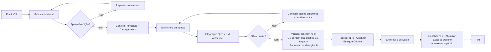

## F1 — Compra Direta (estados)

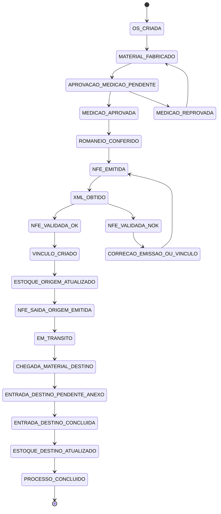

## F2 — Entrega Futura (mãe) — alto nível

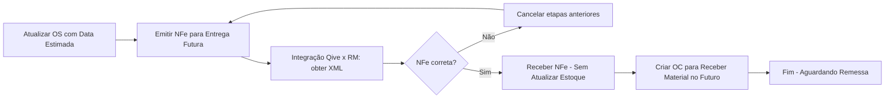

## F2 — Entrega Futura (mãe) — estados

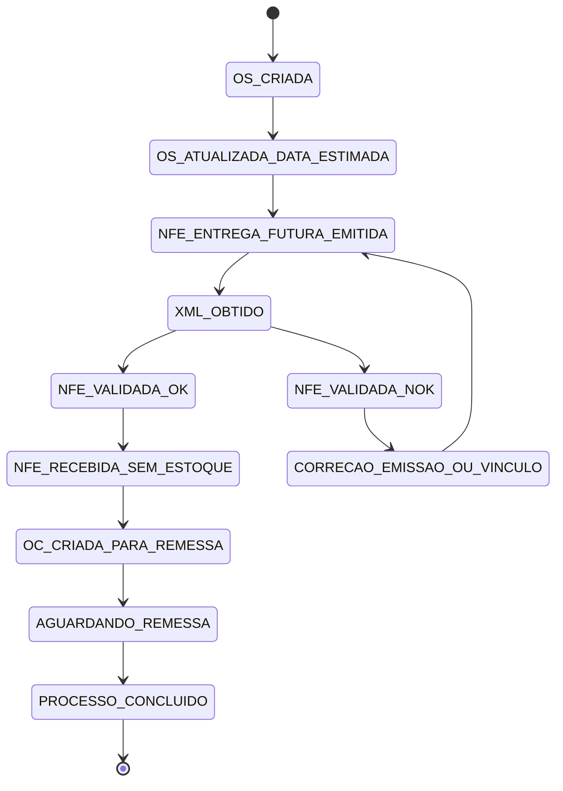

## F3 — Entrega Futura (filha) — alto nível

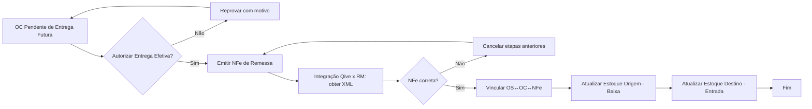

## F3 — Entrega Futura (filha) — estados

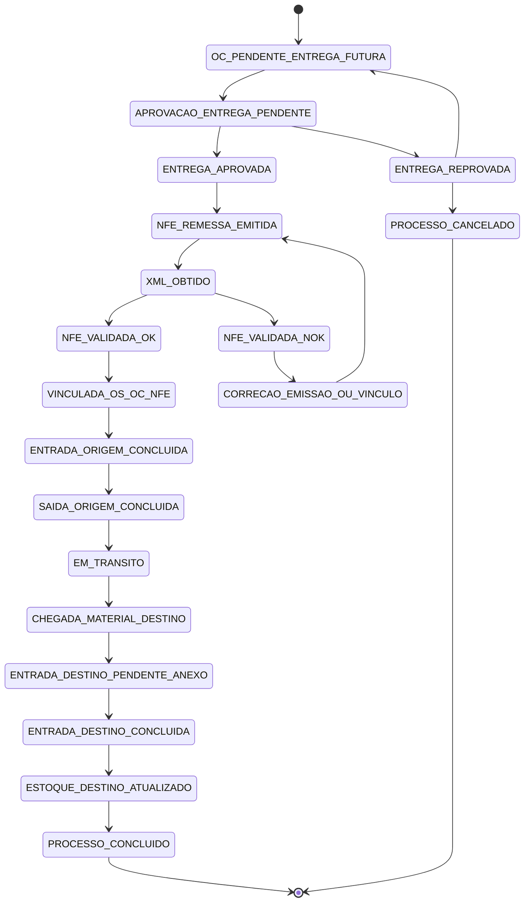

## Modelo de dados (relacionamentos)

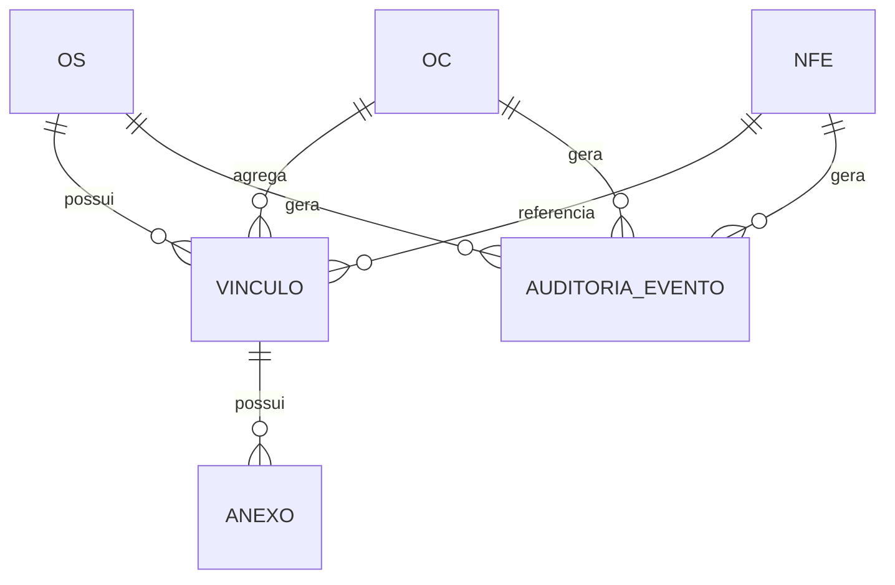

## Arquitetura de Camadas (Clean Architecture)

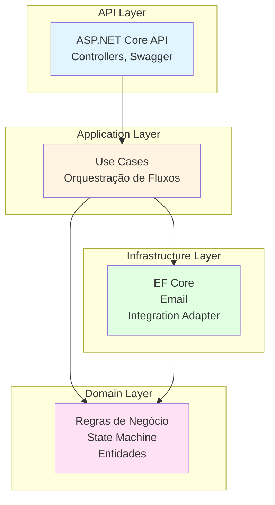

## Fluxo de Integração Qive ↔ RM

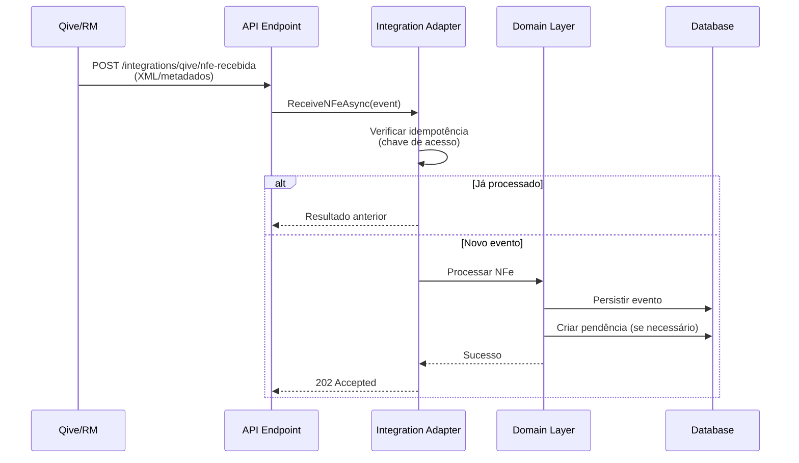

## Fluxo de Validação Fiscal

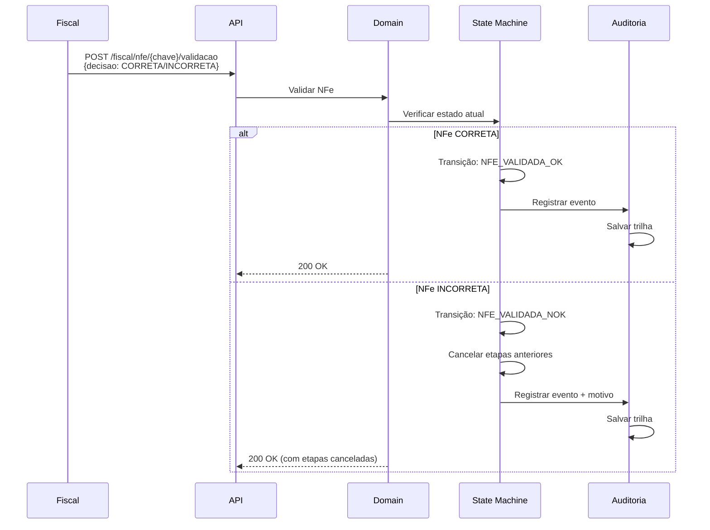

## Fluxo de Notificações

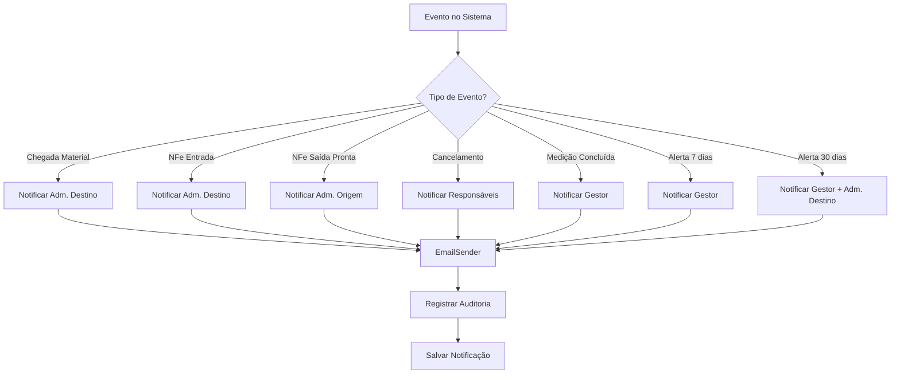

## Matriz de Responsabilidades (RACI)

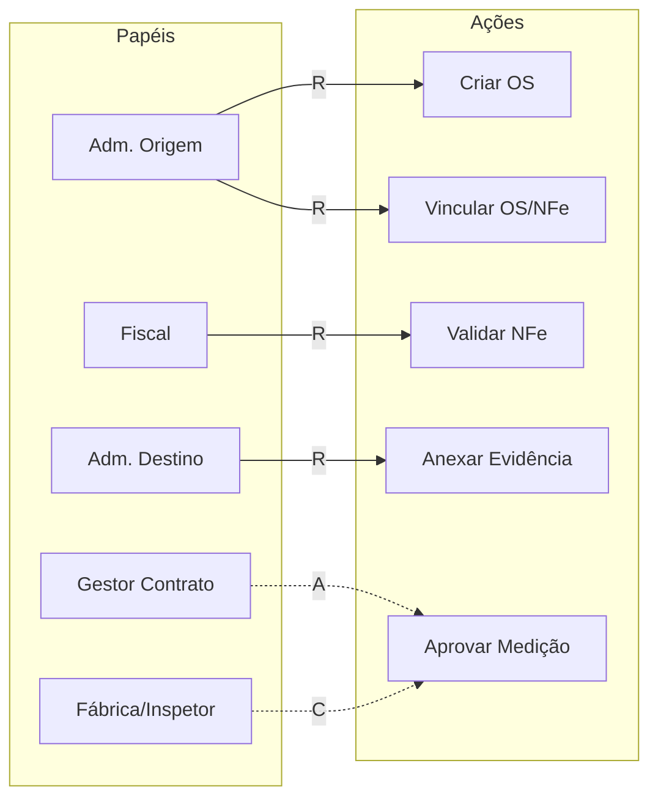

## Resumo de Diagramas

| Tipo | Quantidade | Localização |
|------|------------|-------------|
| Flowchart (Alto Nível) | 3 | F1, F2, F3 |
| State Diagram | 3 | F1, F2, F3 |
| ER Diagram | 1 | Modelo de Dados |
| Architecture Diagram | 1 | Clean Architecture |
| Sequence Diagram | 2 | Integração, Validação Fiscal |
| Flowchart (Notificações) | 1 | Fluxo de Notificações |
| RACI Diagram | 1 | Responsabilidades |
| **Total** | **12** | Este arquivo |
